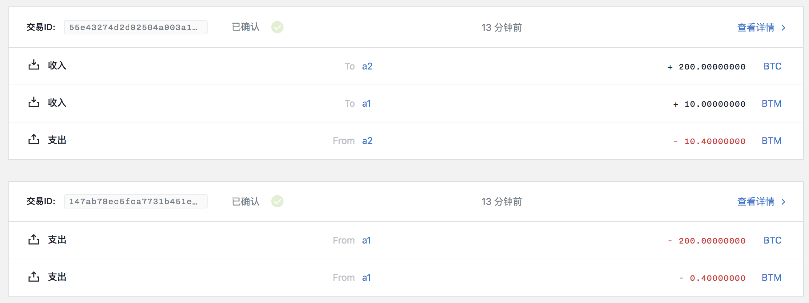

Shuttle
========

[](./LICENSE)

- [1 Background](#1-background)
- [2 Install](#2-install)
  - [2.1 Requirements](#21-requirements)
  - [2.2 Install bytom node](#22-install-bytom-node)
  - [2.3 Build from source code](#23-build-from-source-code)
- [3 Usage](#3-usage)
  - [3.1 Swap assets in bytom or vapor](#31-swap-assets-in-bytom-or-vapor)
    - [3.1.1 Launch bytom node](#311-launch-bytom-node)
    - [3.1.2 Create account and issue your asset](#312-create-account-and-issue-your-asset)
    - [3.1.3 Deploy tradeoff contract](#313-deploy-tradeoff-contract)
    - [3.1.4 Call tradeoff contract](#314-call-tradeoff-contract)
    - [3.1.5 Redeem asset](#315-redeem-asset)
- [4 Contributing](#4-contributing)
- [5 License](#5-license)

## 1 Background

Shuttle is designed to help swap different assets in bytom.

## 2 Install

### 2.1 Requirements

- [Go](https://golang.org/doc/install) version 1.12 or higher, with `$GOPATH` set to your preferred directory

### 2.2 Install bytom node

Firstly, you should install and configure bytom node, see also: [Bytom repository](https://github.com/Bytom/bytom).

### 2.3 Build from source code

This BTM swap tool is still in beta, so repository code will be changed frequently. You can build tool from source code directly.

```shell
$ git clone https://github.com/Bytom/shuttle.git $GOPATH/src/github.com/shuttle
$ cd $GOPATH/src/github.com/shuttle
$ make install
```

Shuttle help information:

```shell
$ swap -h
swap is a commond line client for bytom contract

Usage:
  swap [flags]
  swap [command]

Available Commands:
  callHTLC       call HTLC contract for asset swapping
  callTradeoff   call tradeoff contract for asset swapping
  cancelHTLC     cancel HTLC contract for asset swapping
  cancelTradeoff cancel tradeoff contract for asset swapping
  deployHTLC     deploy HTLC contract
  deployTradeoff deploy tradeoff contract
  help           Help about any command

Flags:
  -h, --help   help for swap

Use "swap [command] --help" for more information about a command.
```

or remove shuttle:

```shell
$ cd $GOPATH/src/github.com/shuttle
$ make clean
```

## 3 Usage

### 3.1 Swap assets in bytom or vapor

#### 3.1.1 Launch bytom node

For testing, you can launch bytom solonet node.

```shell
$ bytomd init --chain_id=solonet --home $HOME/bytom/solonet # init bytom solonet node
$ bytomd node --home $HOME/bytom/solonet --mining           # launch bytom solonet node and start mining
```

#### 3.1.2 Create account and issue your asset

You should create several accounts and issue your asset for testing, more details:

- [Managing Accounts](https://github.com/Bytom/bytom/wiki/Managing-Accounts)
- [Assets registration](https://github.com/Bytom/bytom/wiki/Advanced-Transaction#assets-registration)

For example, in bytom blockchain, account a1 has 200 BTC, account a2 has 10 BTM, they can swap their assets using shuttle.

#### 3.1.3 Deploy tradeoff contract

```shell
$ swap deployTradeoff -h
deploy tradeoff contract

Usage:
  swap deployTradeoff <accountID> <password> [contract flags(paramenters and locked value)] [txFee flag] [URL flags(ip and port)] [flags]

Flags:
      --amountLocked uint       tradeoff contract locked value with amount
      --amountRequested uint    tradeoff contract paramenter with requested amount
      --assetLocked string      tradeoff contract locked value with assetID
      --assetRequested string   tradeoff contract paramenter with requested assetID
      --cancelKey string        tradeoff contract paramenter with seller pubkey for cancelling the contract
  -h, --help                    help for deployTradeoff
      --ip string               network address (default "127.0.0.1")
      --port string             network port (default "9888")
      --seller string           tradeoff contract paramenter with seller control-program
      --txFee uint              contract transaction fee (default 40000000)
```

```shell
$ swap deployTradeoff 10CJPO1HG0A02 12345 --amountLocked 20000000000 --amountRequested 1000000000 --assetLocked bae7e17bb8f5d0cfbfd87a92f3204da082d388d4c9b10e8dcd36b3d0a18ceb3a --assetRequested ffffffffffffffffffffffffffffffffffffffffffffffffffffffffffffffff --cancelKey 3e5d7d52d334964eef173021ef6a04dc0807ac8c41700fe718f5a80c2109f79e --seller 00145dd7b82556226d563b6e7d573fe61d23bd461c1f --txFee 40000000
--> contractUTXOID: 34996b0838108de8c614bc018e8fdbbfc08a47ffbe0fd6d7f41892b90de3999f
```

Then, wait about 2.5 minutes, and a new block will be mined, the contract will be confirmed.

#### 3.1.4 Call tradeoff contract

```shell
$ swap callTradeoff -h
call tradeoff contract for asset swapping

Usage:
  swap callTradeoff <accountID> <password> <buyer-program> <contractUTXOID> [txFee flag] [URL flags(ip and port)] [flags]

Flags:
  -h, --help          help for callTradeoff
      --ip string     network address (default "127.0.0.1")
      --port string   network port (default "9888")
      --txFee uint    contract transaction fee (default 40000000)
```

```shell
$ swap callTradeoff 10CKAD3000A02 12345 00140fdee108543d305308097019ceb5aec3da60ec66 34996b0838108de8c614bc018e8fdbbfc08a47ffbe0fd6d7f41892b90de3999f
--> txID: 55e43274d2d92504a903a13e3f6517d63434fc19a2fa0e1fc0a9a5c8c75e8f6c
```

When the transaction will be confirmed in a new block, the whole swap is successful.



Now, account a1 get 10 BTM, and account a2 get 200 BTC.

#### 3.1.5 Redeem asset

If someone want to cancel this tradeoff transaction, he can call cancelTradeoff.


## 4 Contributing

Welcome to [open an issue](https://github.com/Bytom/btm-swap-tool/issues/new) or submit PRs. This project exists thanks to all the people who contribute.

## 5 License

[MIT](./LICENSE) © 2019 Bytom
