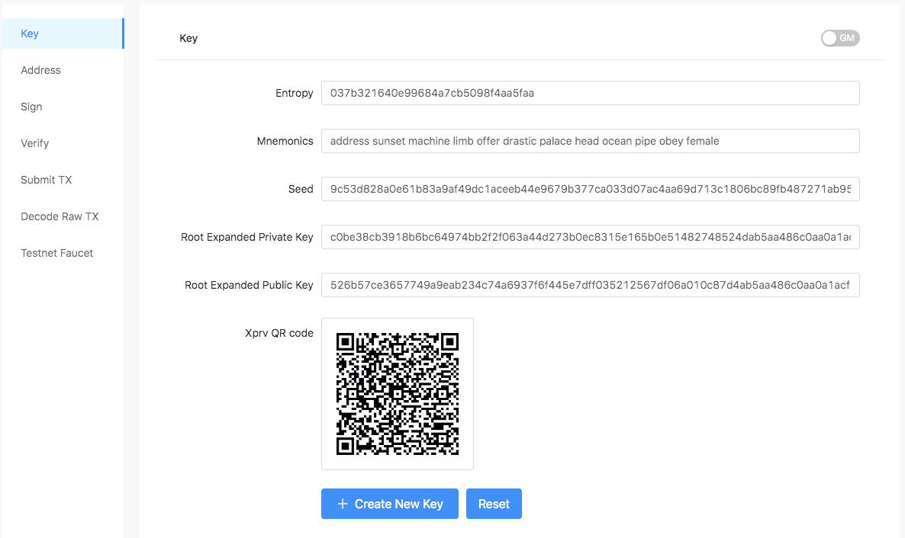
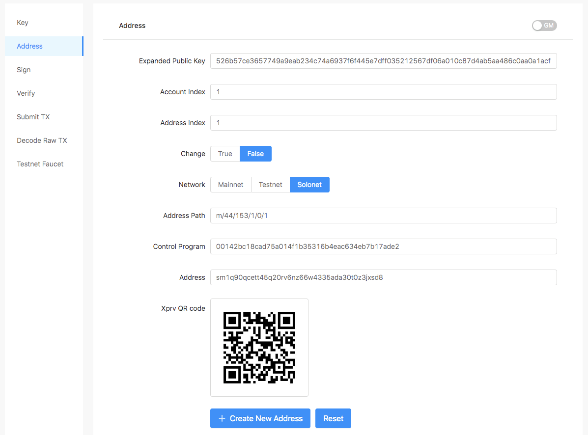
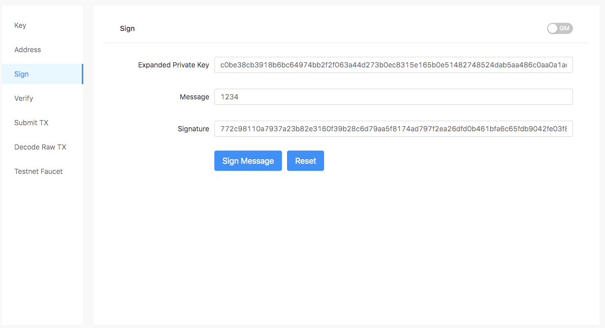
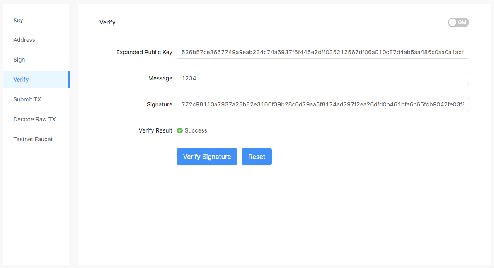
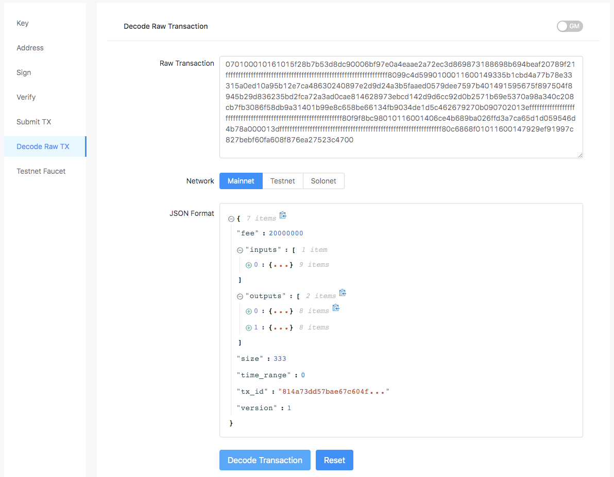
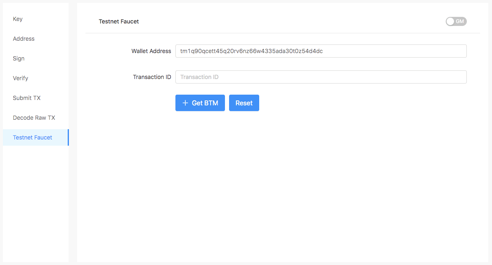

Bytom Kit
==========

- [1 Motivation](#1-motivation)
- [2 Usage](#2-usage)
  - [2.1 Key](#21-key)
  - [2.2 Address](#22-address)
  - [2.3 Sign](#23-sign)
  - [2.4 Verify](#24-verify)
  - [2.5 Submit Transaction](#25-submit-transaction)
  - [2.6 Decode Raw Transaction](#26-decode-raw-transaction)
  - [2.7 Testnet Faucet](#27-testnet-faucet)

## 1 Motivation

Bytom Kit is a simple tool which can help developer to understand Bytom easily. It contains 36 api for now:

- sign
- verify
- create_entropy
- entropy_to_mnemonic
- mnemonic_to_seed
- seed_to_root_xprv
- xprv_to_expanded_private_key
- xpub_to_public_key
- xpub_verify
- xprv_sign
- xprv_to_xpub
- xprv_to_child_xprv
- xpub_to_child_xpub
- create_P2WPKH_program
- create_address
- get_path_from_index
- submit_transaction
- create_qrcode_base64
- create_new_key
- create_new_address
- decode_raw_transaction
- get_gm_root_xprv
- get_gm_xpub
- get_gm_xprv
- get_gm_public_key
- get_gm_child_xprv
- get_gm_child_xpub
- gm_xpub_verify
- gm_xprv_sign
- get_gm_P2WPKH_program
- get_gm_address
- get_gm_new_key
- get_gm_new_address
- decode_raw_tx
- get_testnet_coins
- get_gm_testnet_coins

You post url: https://kit.blockmeta.com/api/v1/api.

For example, create new entropy: https://kit.blockmeta.com/api/v1/create_entropy.

return:

```json
{
    "entropy": "2ebdb49c6cb7108e4d6e134100aa4bd1"
}
```

## 2 Usage

### 2.1 Key

Link: <https://blockmeta.com/tools/key>



### 2.2 Address

Link: <https://blockmeta.com/tools/address>



### 2.3 Sign

Link: <https://blockmeta.com/tools/sign>



### 2.4 Verify

Link: <https://blockmeta.com/tools/verify>



### 2.5 Submit Transaction

Link: <https://blockmeta.com/tools/txs>


### 2.6 Decode Raw Transaction

Link: <https://blockmeta.com/tools/decode>



### 2.7 Testnet Faucet

Link: <https://blockmeta.com/tools/faucet>

