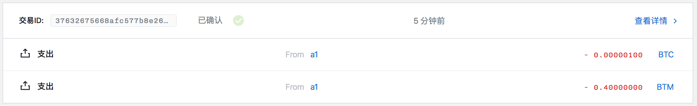
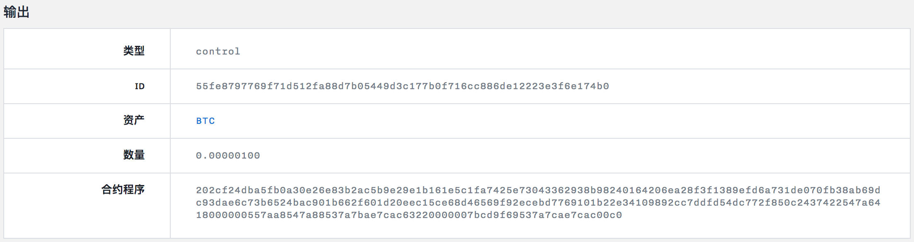
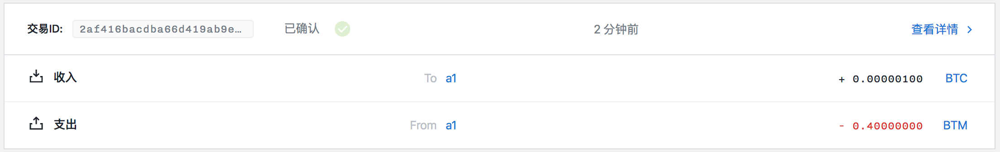

取消 HTLC 实例
==============

- [1 合约实例化](#1-合约实例化)
- [2 部署合约](#2-部署合约)
- [3 创建取消 HTLC 的交易](#3-创建取消-htlc-的交易)
- [4 对数据进行签名](#4-对数据进行签名)
  - [4.1 使用本地 api 签署](#41-使用本地-api-签署)
  - [4.2 使用命令行进行签署](#42-使用命令行进行签署)
- [5 发送交易](#5-发送交易)

## 1 合约实例化

首先 HTC 合约如下：

```
contract HTLC(
  sender: PublicKey,
  recipient: PublicKey,
  blockHeight: Integer,
  hash: Hash
) locks valueAmount of valueAsset {
  clause complete(preimage: String, sig: Signature) {
    verify sha256(preimage) == hash
    verify checkTxSig(recipient, sig)
    unlock valueAmount of valueAsset
  }
  clause cancel(sig: Signature) {
    verify above(blockHeight)
    verify checkTxSig(sender, sig)
    unlock valueAmount of valueAsset
  }
}
```

对合约进行实例化：

```
$ swap equity contracts/htlc --instance eec15ce68d46569f92ecebd7769101b22e34109892cc7ddfd54dc772f850c243 6ea28f3f1389efd6a731de070fb38ab69dc93dae6c73b6524bac901b662f601d 100 2cf24dba5fb0a30e26e83b2ac5b9e29e1b161e5c1fa7425e73043362938b9824
======= HTLC =======
Instantiated program:
202cf24dba5fb0a30e26e83b2ac5b9e29e1b161e5c1fa7425e73043362938b98240164206ea28f3f1389efd6a731de070fb38ab69dc93dae6c73b6524bac901b662f601d20eec15ce68d46569f92ecebd7769101b22e34109892cc7ddfd54dc772f850c2437422547a6418000000557aa8547a88537a7bae7cac63220000007bcd9f69537a7cae7cac00c0
```

其中：

- contracts/htlc 表示 HTLC 合约所在目录
- eec15ce68d46569f92ecebd7769101b22e34109892cc7ddfd54dc772f850c243 ：发送者公钥，是账户 a1 的第一个非找零地址所对应公钥，对应地址为 sm1qtv9grtw9cttg4xt8pq4qnjtwsttz4gzcp02cr3
- 6ea28f3f1389efd6a731de070fb38ab69dc93dae6c73b6524bac901b662f601d ：接受者公钥，是账户 a2 的第一个非找零地址所对应公钥，对应地址为 sm1qpl0wzzz585c9xzqfwqvuaddwc0dxpmrxzp56s5
- 100 ：限定合约锁定的高度
- 2cf24dba5fb0a30e26e83b2ac5b9e29e1b161e5c1fa7425e73043362938b9824 ：hello 的哈希值

202cf24dba5fb0a30e26e83b2ac5b9e29e1b161e5c1fa7425e73043362938b98240164206ea28f3f1389efd6a731de070fb38ab69dc93dae6c73b6524bac901b662f601d20eec15ce68d46569f92ecebd7769101b22e34109892cc7ddfd54dc772f850c2437422547a6418000000557aa8547a88537a7bae7cac63220000007bcd9f69537a7cae7cac00c0 就是 HTLC 实例化结果。

## 2 部署合约

部署合约详细过程参照[部署HTLC实例](./部署HTLC实例.md)。

构建合约：

```
$ swap deployhtlc e18b91ba-91a5-4837-9d41-ce2b76cea81c bae7e17bb8f5d0cfbfd87a92f3204da082d388d4c9b10e8dcd36b3d0a18ceb3a 100 202cf24dba5fb0a30e26e83b2ac5b9e29e1b161e5c1fa7425e73043362938b98240164206ea28f3f1389efd6a731de070fb38ab69dc93dae6c73b6524bac901b662f601d20eec15ce68d46569f92ecebd7769101b22e34109892cc7ddfd54dc772f850c2437422547a6418000000557aa8547a88537a7bae7cac63220000007bcd9f69537a7cae7cac00c0
buildTx: {"guid":"e18b91ba-91a5-4837-9d41-ce2b76cea81c","fee":40000000,"confirmations":1,"inputs":[{"type":"spend_wallet","asset":"bae7e17bb8f5d0cfbfd87a92f3204da082d388d4c9b10e8dcd36b3d0a18ceb3a","amount":100}],"outputs":[{"type":"control_program","amount":100,"asset":"bae7e17bb8f5d0cfbfd87a92f3204da082d388d4c9b10e8dcd36b3d0a18ceb3a","control_program":"202cf24dba5fb0a30e26e83b2ac5b9e29e1b161e5c1fa7425e73043362938b98240164206ea28f3f1389efd6a731de070fb38ab69dc93dae6c73b6524bac901b662f601d20eec15ce68d46569f92ecebd7769101b22e34109892cc7ddfd54dc772f850c2437422547a6418000000557aa8547a88537a7bae7cac63220000007bcd9f69537a7cae7cac00c0"}]}
build tx result: {
	"raw_transaction": "07010002015d015bab5d3e83a2055d7d02381106a1b4fd44af5c4fac2fbaa2dde5e40a6e5a49932fbae7e17bb8f5d0cfbfd87a92f3204da082d388d4c9b10e8dcd36b3d0a18ceb3acd020101160014d7088f9e2c040a6a6dc3cfda2306846908d12e05220120a550d20483af8a0ed02d061d1659f1346a16566d4afa93c49dbce9bc5a5bf5590161015f1da504a9a458a6a53918b786faf8dede31aae0e5ef4ff0a85b4c94365bab3ef6ffffffffffffffffffffffffffffffffffffffffffffffffffffffffffffffff8099c4d5990100011600145b0a81adc5c2d68a9967082a09c96e82d62aa058220120eec15ce68d46569f92ecebd7769101b22e34109892cc7ddfd54dc772f850c2430301af01bae7e17bb8f5d0cfbfd87a92f3204da082d388d4c9b10e8dcd36b3d0a18ceb3a64018b01202cf24dba5fb0a30e26e83b2ac5b9e29e1b161e5c1fa7425e73043362938b98240164206ea28f3f1389efd6a731de070fb38ab69dc93dae6c73b6524bac901b662f601d20eec15ce68d46569f92ecebd7769101b22e34109892cc7ddfd54dc772f850c2437422547a6418000000557aa8547a88537a7bae7cac63220000007bcd9f69537a7cae7cac00c000013abae7e17bb8f5d0cfbfd87a92f3204da082d388d4c9b10e8dcd36b3d0a18ceb3ae90101160014d7088f9e2c040a6a6dc3cfda2306846908d12e0500013effffffffffffffffffffffffffffffffffffffffffffffffffffffffffffffff80e5bac2990101160014d7088f9e2c040a6a6dc3cfda2306846908d12e0500",
	"signing_instructions": [
		{
			"derivation_path": [
				"2c000000",
				"99000000",
				"01000000",
				"00000000",
				"02000000"
			],
			"sign_data": [
				"fa72161899a9faee5374725bcf3d2bd9ea062c2b8110f40495f0cb5b615cf21f"
			],
			"pubkey": "a550d20483af8a0ed02d061d1659f1346a16566d4afa93c49dbce9bc5a5bf559"
		},
		{
			"derivation_path": [
				"2c000000",
				"99000000",
				"01000000",
				"00000000",
				"01000000"
			],
			"sign_data": [
				"48f876b6501b2b98921833f790a53f85dff5b2c8f663c57885b90a42e4e99e08"
			],
			"pubkey": "eec15ce68d46569f92ecebd7769101b22e34109892cc7ddfd54dc772f850c243"
		}
	],
	"fee": 40000000
}
```

对合约数据进行签名：

post:

```json
{
    "address": "sm1q6uygl83vqs9x5mwreldzxp5ydyydzts9lt259g",
    "message": "fa72161899a9faee5374725bcf3d2bd9ea062c2b8110f40495f0cb5b615cf21f",
    "password": "12345"
}
```

response:

```json
{
    "status": "success",
    "data": {
        "signature": "485a7795ad43ed9866d9a76c5f5d3eb6a67cf588789eb7cf4d33fdefdf7fee3e2e11b2402b686dd78ec06ca5fd70029ff0556d17a9cb9981b512c03a8cfe3607",
        "derived_xpub": "a550d20483af8a0ed02d061d1659f1346a16566d4afa93c49dbce9bc5a5bf5595cb4dbf18bca83cd53574004c0f7e128f8629d931717facde6aa79d4ba355e6f"
    }
}
```

post:

```json
{
    "address": "sm1qtv9grtw9cttg4xt8pq4qnjtwsttz4gzcp02cr3",
    "message": "48f876b6501b2b98921833f790a53f85dff5b2c8f663c57885b90a42e4e99e08",
    "password": "12345"
}
```

response:

```json
{
    "status": "success",
    "data": {
        "signature": "5ad22fc28c9a86928a6ae0c40a620367cf325ae9487af9f1f9079c7054e93f3c3ae85fb4f5f5f2be3c1dd82231cd6ee1a818e5432c6a7d0d16e0e6de1a090e08",
        "derived_xpub": "eec15ce68d46569f92ecebd7769101b22e34109892cc7ddfd54dc772f850c243013095e747f609c86703ee7c0281b2182dfaca66d60ea58814d7929e6b6968a5"
    }
}
```

提交交易：

```
$ swap submit deployhtlc e18b91ba-91a5-4837-9d41-ce2b76cea81c 07010002015d015bab5d3e83a2055d7d02381106a1b4fd44af5c4fac2fbaa2dde5e40a6e5a49932fbae7e17bb8f5d0cfbfd87a92f3204da082d388d4c9b10e8dcd36b3d0a18ceb3acd020101160014d7088f9e2c040a6a6dc3cfda2306846908d12e05220120a550d20483af8a0ed02d061d1659f1346a16566d4afa93c49dbce9bc5a5bf5590161015f1da504a9a458a6a53918b786faf8dede31aae0e5ef4ff0a85b4c94365bab3ef6ffffffffffffffffffffffffffffffffffffffffffffffffffffffffffffffff8099c4d5990100011600145b0a81adc5c2d68a9967082a09c96e82d62aa058220120eec15ce68d46569f92ecebd7769101b22e34109892cc7ddfd54dc772f850c2430301af01bae7e17bb8f5d0cfbfd87a92f3204da082d388d4c9b10e8dcd36b3d0a18ceb3a64018b01202cf24dba5fb0a30e26e83b2ac5b9e29e1b161e5c1fa7425e73043362938b98240164206ea28f3f1389efd6a731de070fb38ab69dc93dae6c73b6524bac901b662f601d20eec15ce68d46569f92ecebd7769101b22e34109892cc7ddfd54dc772f850c2437422547a6418000000557aa8547a88537a7bae7cac63220000007bcd9f69537a7cae7cac00c000013abae7e17bb8f5d0cfbfd87a92f3204da082d388d4c9b10e8dcd36b3d0a18ceb3ae90101160014d7088f9e2c040a6a6dc3cfda2306846908d12e0500013effffffffffffffffffffffffffffffffffffffffffffffffffffffffffffffff80e5bac2990101160014d7088f9e2c040a6a6dc3cfda2306846908d12e0500 485a7795ad43ed9866d9a76c5f5d3eb6a67cf588789eb7cf4d33fdefdf7fee3e2e11b2402b686dd78ec06ca5fd70029ff0556d17a9cb9981b512c03a8cfe3607 5ad22fc28c9a86928a6ae0c40a620367cf325ae9487af9f1f9079c7054e93f3c3ae85fb4f5f5f2be3c1dd82231cd6ee1a818e5432c6a7d0d16e0e6de1a090e08
submitPayment: {"guid":"e18b91ba-91a5-4837-9d41-ce2b76cea81c","raw_transaction":"07010002015d015bab5d3e83a2055d7d02381106a1b4fd44af5c4fac2fbaa2dde5e40a6e5a49932fbae7e17bb8f5d0cfbfd87a92f3204da082d388d4c9b10e8dcd36b3d0a18ceb3acd020101160014d7088f9e2c040a6a6dc3cfda2306846908d12e05220120a550d20483af8a0ed02d061d1659f1346a16566d4afa93c49dbce9bc5a5bf5590161015f1da504a9a458a6a53918b786faf8dede31aae0e5ef4ff0a85b4c94365bab3ef6ffffffffffffffffffffffffffffffffffffffffffffffffffffffffffffffff8099c4d5990100011600145b0a81adc5c2d68a9967082a09c96e82d62aa058220120eec15ce68d46569f92ecebd7769101b22e34109892cc7ddfd54dc772f850c2430301af01bae7e17bb8f5d0cfbfd87a92f3204da082d388d4c9b10e8dcd36b3d0a18ceb3a64018b01202cf24dba5fb0a30e26e83b2ac5b9e29e1b161e5c1fa7425e73043362938b98240164206ea28f3f1389efd6a731de070fb38ab69dc93dae6c73b6524bac901b662f601d20eec15ce68d46569f92ecebd7769101b22e34109892cc7ddfd54dc772f850c2437422547a6418000000557aa8547a88537a7bae7cac63220000007bcd9f69537a7cae7cac00c000013abae7e17bb8f5d0cfbfd87a92f3204da082d388d4c9b10e8dcd36b3d0a18ceb3ae90101160014d7088f9e2c040a6a6dc3cfda2306846908d12e0500013effffffffffffffffffffffffffffffffffffffffffffffffffffffffffffffff80e5bac2990101160014d7088f9e2c040a6a6dc3cfda2306846908d12e0500","signatures":[["485a7795ad43ed9866d9a76c5f5d3eb6a67cf588789eb7cf4d33fdefdf7fee3e2e11b2402b686dd78ec06ca5fd70029ff0556d17a9cb9981b512c03a8cfe3607"],["5ad22fc28c9a86928a6ae0c40a620367cf325ae9487af9f1f9079c7054e93f3c3ae85fb4f5f5f2be3c1dd82231cd6ee1a818e5432c6a7d0d16e0e6de1a090e08"]],"memo":""}
submit deployhtlc tx result: 37632675668afc577b8e26d1827c1288ce4a26200a72b30fc88c43db1cccf849
```



查询得到锁定到合约的 UTXO ID 为 55fe8797769f71d512fa88d7b05449d3c177b0f716cc886de12223e3f6e174b0。



## 3 创建取消 HTLC 的交易

```
$ swap cancelhtlc -h
cancel HTLC contract

Usage:
  swap cancelhtlc <guid> <contractUTXOID> <contractAsset> <contractAmount> <receiver> [URL flags(ip and port)] [flags]

Flags:
  -h, --help          help for cancelhtlc
      --ip string     network address (default "127.0.0.1")
      --port string   network port (default "9888")
```

```
$ swap cancelhtlc e18b91ba-91a5-4837-9d41-ce2b76cea81c 55fe8797769f71d512fa88d7b05449d3c177b0f716cc886de12223e3f6e174b0 bae7e17bb8f5d0cfbfd87a92f3204da082d388d4c9b10e8dcd36b3d0a18ceb3a 100 sm1qtv9grtw9cttg4xt8pq4qnjtwsttz4gzcp02cr3
build unlocked contract tx: {"guid":"e18b91ba-91a5-4837-9d41-ce2b76cea81c","fee":40000000,"confirmations":1,"inputs":[{"type":"spend_utxo","output_id":"55fe8797769f71d512fa88d7b05449d3c177b0f716cc886de12223e3f6e174b0"}],"outputs":[{"type":"control_address","amount":100,"asset":"bae7e17bb8f5d0cfbfd87a92f3204da082d388d4c9b10e8dcd36b3d0a18ceb3a","address":"sm1qtv9grtw9cttg4xt8pq4qnjtwsttz4gzcp02cr3"}]}
build call htlc tx result: {
	"raw_transaction": "0701000201d30101d001770f0e140917eed0f5296b88397a586b9661fcb5a4188d56dbf48219669d1a7cbae7e17bb8f5d0cfbfd87a92f3204da082d388d4c9b10e8dcd36b3d0a18ceb3a6400018b01202cf24dba5fb0a30e26e83b2ac5b9e29e1b161e5c1fa7425e73043362938b98240164206ea28f3f1389efd6a731de070fb38ab69dc93dae6c73b6524bac901b662f601d20eec15ce68d46569f92ecebd7769101b22e34109892cc7ddfd54dc772f850c2437422547a6418000000557aa8547a88537a7bae7cac63220000007bcd9f69537a7cae7cac00c001000161015ffcce4f44a62bb697a267ff2aadabee04bf586b0074b6781fef970cf3520d73bfffffffffffffffffffffffffffffffffffffffffffffffffffffffffffffffff8099c4d5990100011600145b0a81adc5c2d68a9967082a09c96e82d62aa058220120eec15ce68d46569f92ecebd7769101b22e34109892cc7ddfd54dc772f850c243020139bae7e17bb8f5d0cfbfd87a92f3204da082d388d4c9b10e8dcd36b3d0a18ceb3a64011600145b0a81adc5c2d68a9967082a09c96e82d62aa05800013effffffffffffffffffffffffffffffffffffffffffffffffffffffffffffffff80e5bac29901011600145b0a81adc5c2d68a9967082a09c96e82d62aa05800",
	"signing_instructions": [
		{
			"derivation_path": null,
			"sign_data": [
				"ce030c1e57e44f59ebd6bf6e07b178fc4f7ce048380ba033c5b8b482505049b3"
			]
		},
		{
			"derivation_path": [
				"2c000000",
				"99000000",
				"01000000",
				"00000000",
				"01000000"
			],
			"sign_data": [
				"776e41e2d9eeb50e10a1d3497643402f2784df1debcc6b32296d68f3bbbc883b"
			],
			"pubkey": "eec15ce68d46569f92ecebd7769101b22e34109892cc7ddfd54dc772f850c243"
		}
	],
	"fee": 40000000
}
```

其中：

- e18b91ba-91a5-4837-9d41-ce2b76cea81c：用户的 guid
- 55fe8797769f71d512fa88d7b05449d3c177b0f716cc886de12223e3f6e174b0：调用的 UTXO ID
- bae7e17bb8f5d0cfbfd87a92f3204da082d388d4c9b10e8dcd36b3d0a18ceb3a：锁定到合约的资产 ID
- 100：锁定资产的数量
- sm1qtv9grtw9cttg4xt8pq4qnjtwsttz4gzcp02cr3：接收解锁资产的用户地址

对 raw_transaction 进行解析：

```
$ bytomcli decode-raw-transaction 0701000201d30101d001770f0e140917eed0f5296b88397a586b9661fcb5a4188d56dbf48219669d1a7cbae7e17bb8f5d0cfbfd87a92f3204da082d388d4c9b10e8dcd36b3d0a18ceb3a6400018b01202cf24dba5fb0a30e26e83b2ac5b9e29e1b161e5c1fa7425e73043362938b98240164206ea28f3f1389efd6a731de070fb38ab69dc93dae6c73b6524bac901b662f601d20eec15ce68d46569f92ecebd7769101b22e34109892cc7ddfd54dc772f850c2437422547a6418000000557aa8547a88537a7bae7cac63220000007bcd9f69537a7cae7cac00c001000161015ffcce4f44a62bb697a267ff2aadabee04bf586b0074b6781fef970cf3520d73bfffffffffffffffffffffffffffffffffffffffffffffffffffffffffffffffff8099c4d5990100011600145b0a81adc5c2d68a9967082a09c96e82d62aa058220120eec15ce68d46569f92ecebd7769101b22e34109892cc7ddfd54dc772f850c243020139bae7e17bb8f5d0cfbfd87a92f3204da082d388d4c9b10e8dcd36b3d0a18ceb3a64011600145b0a81adc5c2d68a9967082a09c96e82d62aa05800013effffffffffffffffffffffffffffffffffffffffffffffffffffffffffffffff80e5bac29901011600145b0a81adc5c2d68a9967082a09c96e82d62aa05800
```

```json
{
  "fee": 40000000,
  "inputs": [
    {
      "amount": 100,
      "asset_definition": {},
      "asset_id": "bae7e17bb8f5d0cfbfd87a92f3204da082d388d4c9b10e8dcd36b3d0a18ceb3a",
      "control_program": "202cf24dba5fb0a30e26e83b2ac5b9e29e1b161e5c1fa7425e73043362938b98240164206ea28f3f1389efd6a731de070fb38ab69dc93dae6c73b6524bac901b662f601d20eec15ce68d46569f92ecebd7769101b22e34109892cc7ddfd54dc772f850c2437422547a6418000000557aa8547a88537a7bae7cac63220000007bcd9f69537a7cae7cac00c0",
      "input_id": "32d7a22afd9321cf0e388975ff1c0627d2bd62d3eb2d425605f05c043a2d2253",
      "sign_data": "ce030c1e57e44f59ebd6bf6e07b178fc4f7ce048380ba033c5b8b482505049b3",
      "spent_output_id": "55fe8797769f71d512fa88d7b05449d3c177b0f716cc886de12223e3f6e174b0",
      "type": "spend",
      "witness_arguments": null
    },
    {
      "address": "sm1qtv9grtw9cttg4xt8pq4qnjtwsttz4gzcp02cr3",
      "amount": 41250000000,
      "asset_definition": {},
      "asset_id": "ffffffffffffffffffffffffffffffffffffffffffffffffffffffffffffffff",
      "control_program": "00145b0a81adc5c2d68a9967082a09c96e82d62aa058",
      "input_id": "7a9596220e4109a3c86f1b8052ac4db5bc15b0b71289e56a9fab1f00abfbc2b4",
      "sign_data": "776e41e2d9eeb50e10a1d3497643402f2784df1debcc6b32296d68f3bbbc883b",
      "spent_output_id": "5a0f1ce9ea8c8fb1f3c68a287c876cc72adddb53d920c5f19f5a616d12edd672",
      "type": "spend",
      "witness_arguments": [
        "eec15ce68d46569f92ecebd7769101b22e34109892cc7ddfd54dc772f850c243"
      ]
    }
  ],
  "outputs": [
    {
      "address": "sm1qtv9grtw9cttg4xt8pq4qnjtwsttz4gzcp02cr3",
      "amount": 100,
      "asset_definition": {},
      "asset_id": "bae7e17bb8f5d0cfbfd87a92f3204da082d388d4c9b10e8dcd36b3d0a18ceb3a",
      "control_program": "00145b0a81adc5c2d68a9967082a09c96e82d62aa058",
      "id": "2a9771ef5b5377b47524d34d66628b6b2f0fb3030411089da4c786b46a3eab71",
      "position": 0,
      "type": "control"
    },
    {
      "address": "sm1qtv9grtw9cttg4xt8pq4qnjtwsttz4gzcp02cr3",
      "amount": 41210000000,
      "asset_definition": {},
      "asset_id": "ffffffffffffffffffffffffffffffffffffffffffffffffffffffffffffffff",
      "control_program": "00145b0a81adc5c2d68a9967082a09c96e82d62aa058",
      "id": "993843fd4815893bc3cc3d13bf43c3dd3ab5b9b19ef95e269739ca6595da40ce",
      "position": 1,
      "type": "control"
    }
  ],
  "size": 480,
  "time_range": 0,
  "tx_id": "2af416bacdba66d419ab9e654ffb740193c8ba0bcf6517cb36982391106efa96",
  "version": 1
}
```

## 4 对数据进行签名

需要签名的数据有两个：

- ce030c1e57e44f59ebd6bf6e07b178fc4f7ce048380ba033c5b8b482505049b3
- 776e41e2d9eeb50e10a1d3497643402f2784df1debcc6b32296d68f3bbbc883b

有两种数据签名方法，可任选其一。

### 4.1 使用本地 api 签署

调用 127.0.0.1:9888/sign-message api 对 ce030c1e57e44f59ebd6bf6e07b178fc4f7ce048380ba033c5b8b482505049b3 进行签名：

post:

```json
{
    "address": "sm1qtv9grtw9cttg4xt8pq4qnjtwsttz4gzcp02cr3",
    "message": "ce030c1e57e44f59ebd6bf6e07b178fc4f7ce048380ba033c5b8b482505049b3",
    "password": "12345"
}
```

对合约进行解锁的时候，因为 sender 公钥对应的地址是账户 a1 的地址 sm1qtv9grtw9cttg4xt8pq4qnjtwsttz4gzcp02cr3，所以调用该函数对数据进行签名。

response:

```json
{
    "status": "success",
    "data": {
        "signature": "7d9a474aece86b1339c1b5337b96875ba28969b163f6f6e8b7c1968adea1e02f047256b12029af803513910064bff8e80cfe31144de54a48c78c4a74e26a7c0b",
        "derived_xpub": "eec15ce68d46569f92ecebd7769101b22e34109892cc7ddfd54dc772f850c243013095e747f609c86703ee7c0281b2182dfaca66d60ea58814d7929e6b6968a5"
    }
}
```

调用 127.0.0.1:9888/sign-message api 对 776e41e2d9eeb50e10a1d3497643402f2784df1debcc6b32296d68f3bbbc883b 进行签名：

post:

```json
{
    "address": "sm1qtv9grtw9cttg4xt8pq4qnjtwsttz4gzcp02cr3",
    "message": "776e41e2d9eeb50e10a1d3497643402f2784df1debcc6b32296d68f3bbbc883b",
    "password": "12345"
}
```

response:

```json
{
    "status": "success",
    "data": {
        "signature": "1e836948c59c1d104914d14f707ada807aecef3584e20e266bd1ccd001221087a4602450ad4a19965989603fce38d1ef82ee86b83ed9c0a7e5e2c24386f44d03",
        "derived_xpub": "eec15ce68d46569f92ecebd7769101b22e34109892cc7ddfd54dc772f850c243013095e747f609c86703ee7c0281b2182dfaca66d60ea58814d7929e6b6968a5"
    }
}
```

### 4.2 使用命令行进行签署

```
$ swap sign -h
sign message

Usage:
  swap sign <xprv> <message> [flags]

Flags:
  -h, --help   help for sign
```

```
$ swap sign 682d87647c76edafb0c0bdb8b9a87e84f79627c86a4d7620c89a9ef7551ecf47013095e747f609c86703ee7c0281b2182dfaca66d60ea58814d7929e6b6968a5 ce030c1e57e44f59ebd6bf6e07b178fc4f7ce048380ba033c5b8b482505049b3

sign result:
xprv: 682d87647c76edafb0c0bdb8b9a87e84f79627c86a4d7620c89a9ef7551ecf47013095e747f609c86703ee7c0281b2182dfaca66d60ea58814d7929e6b6968a5
message: ce030c1e57e44f59ebd6bf6e07b178fc4f7ce048380ba033c5b8b482505049b3
signature: 7d9a474aece86b1339c1b5337b96875ba28969b163f6f6e8b7c1968adea1e02f047256b12029af803513910064bff8e80cfe31144de54a48c78c4a74e26a7c0b
```

其中：

- 682d87647c76edafb0c0bdb8b9a87e84f79627c86a4d7620c89a9ef7551ecf47013095e747f609c86703ee7c0281b2182dfaca66d60ea58814d7929e6b6968a5：账户 a1 的扩展私钥，因为账户 a1 需要取消 HTLC，则取消的时候需要验证合约中 sender 对应的签名，该合约中 sender 公钥为 eec15ce68d46569f92ecebd7769101b22e34109892cc7ddfd54dc772f850c243。
- ce030c1e57e44f59ebd6bf6e07b178fc4f7ce048380ba033c5b8b482505049b3：需要签名的数据。

```
$ swap sign 682d87647c76edafb0c0bdb8b9a87e84f79627c86a4d7620c89a9ef7551ecf47013095e747f609c86703ee7c0281b2182dfaca66d60ea58814d7929e6b6968a5 776e41e2d9eeb50e10a1d3497643402f2784df1debcc6b32296d68f3bbbc883b

sign result:
xprv: 682d87647c76edafb0c0bdb8b9a87e84f79627c86a4d7620c89a9ef7551ecf47013095e747f609c86703ee7c0281b2182dfaca66d60ea58814d7929e6b6968a5
message: 776e41e2d9eeb50e10a1d3497643402f2784df1debcc6b32296d68f3bbbc883b
signature: 1e836948c59c1d104914d14f707ada807aecef3584e20e266bd1ccd001221087a4602450ad4a19965989603fce38d1ef82ee86b83ed9c0a7e5e2c24386f44d03
```

## 5 发送交易

```
$ swap submit -h
submit a payment

Usage:
  swap submit <action> <guid> <rawTx> [spend parameters] [URL flags(ip and port)] [flags]

Flags:
  -h, --help          help for submit
      --ip string     network address (default "127.0.0.1")
      --port string   network port (default "3000")
```

```
$ swap submit cancelhtlc e18b91ba-91a5-4837-9d41-ce2b76cea81c 0701000201d30101d001770f0e140917eed0f5296b88397a586b9661fcb5a4188d56dbf48219669d1a7cbae7e17bb8f5d0cfbfd87a92f3204da082d388d4c9b10e8dcd36b3d0a18ceb3a6400018b01202cf24dba5fb0a30e26e83b2ac5b9e29e1b161e5c1fa7425e73043362938b98240164206ea28f3f1389efd6a731de070fb38ab69dc93dae6c73b6524bac901b662f601d20eec15ce68d46569f92ecebd7769101b22e34109892cc7ddfd54dc772f850c2437422547a6418000000557aa8547a88537a7bae7cac63220000007bcd9f69537a7cae7cac00c001000161015ffcce4f44a62bb697a267ff2aadabee04bf586b0074b6781fef970cf3520d73bfffffffffffffffffffffffffffffffffffffffffffffffffffffffffffffffff8099c4d5990100011600145b0a81adc5c2d68a9967082a09c96e82d62aa058220120eec15ce68d46569f92ecebd7769101b22e34109892cc7ddfd54dc772f850c243020139bae7e17bb8f5d0cfbfd87a92f3204da082d388d4c9b10e8dcd36b3d0a18ceb3a64011600145b0a81adc5c2d68a9967082a09c96e82d62aa05800013effffffffffffffffffffffffffffffffffffffffffffffffffffffffffffffff80e5bac29901011600145b0a81adc5c2d68a9967082a09c96e82d62aa05800 7d9a474aece86b1339c1b5337b96875ba28969b163f6f6e8b7c1968adea1e02f047256b12029af803513910064bff8e80cfe31144de54a48c78c4a74e26a7c0b 1e836948c59c1d104914d14f707ada807aecef3584e20e266bd1ccd001221087a4602450ad4a19965989603fce38d1ef82ee86b83ed9c0a7e5e2c24386f44d03
submitPayment: {"guid":"e18b91ba-91a5-4837-9d41-ce2b76cea81c","raw_transaction":"0701000201d30101d001770f0e140917eed0f5296b88397a586b9661fcb5a4188d56dbf48219669d1a7cbae7e17bb8f5d0cfbfd87a92f3204da082d388d4c9b10e8dcd36b3d0a18ceb3a6400018b01202cf24dba5fb0a30e26e83b2ac5b9e29e1b161e5c1fa7425e73043362938b98240164206ea28f3f1389efd6a731de070fb38ab69dc93dae6c73b6524bac901b662f601d20eec15ce68d46569f92ecebd7769101b22e34109892cc7ddfd54dc772f850c2437422547a6418000000557aa8547a88537a7bae7cac63220000007bcd9f69537a7cae7cac00c001000161015ffcce4f44a62bb697a267ff2aadabee04bf586b0074b6781fef970cf3520d73bfffffffffffffffffffffffffffffffffffffffffffffffffffffffffffffffff8099c4d5990100011600145b0a81adc5c2d68a9967082a09c96e82d62aa058220120eec15ce68d46569f92ecebd7769101b22e34109892cc7ddfd54dc772f850c243020139bae7e17bb8f5d0cfbfd87a92f3204da082d388d4c9b10e8dcd36b3d0a18ceb3a64011600145b0a81adc5c2d68a9967082a09c96e82d62aa05800013effffffffffffffffffffffffffffffffffffffffffffffffffffffffffffffff80e5bac29901011600145b0a81adc5c2d68a9967082a09c96e82d62aa05800","signatures":[["7d9a474aece86b1339c1b5337b96875ba28969b163f6f6e8b7c1968adea1e02f047256b12029af803513910064bff8e80cfe31144de54a48c78c4a74e26a7c0b","01"],["1e836948c59c1d104914d14f707ada807aecef3584e20e266bd1ccd001221087a4602450ad4a19965989603fce38d1ef82ee86b83ed9c0a7e5e2c24386f44d03"]],"memo":""}
submit cancelhtlc tx result: 2af416bacdba66d419ab9e654ffb740193c8ba0bcf6517cb36982391106efa96
```

其中：

- cancelhtlc：提交的交易类型是取消 HTLC 合约。
- e18b91ba-91a5-4837-9d41-ce2b76cea81c：用户的 guid。
- 0701000201d30101d001770f0e140917eed0f5296b88397a586b9661fcb5a4188d56dbf48219669d1a7cbae7e17bb8f5d0cfbfd87a92f3204da082d388d4c9b10e8dcd36b3d0a18ceb3a6400018b01202cf24dba5fb0a30e26e83b2ac5b9e29e1b161e5c1fa7425e73043362938b98240164206ea28f3f1389efd6a731de070fb38ab69dc93dae6c73b6524bac901b662f601d20eec15ce68d46569f92ecebd7769101b22e34109892cc7ddfd54dc772f850c2437422547a6418000000557aa8547a88537a7bae7cac63220000007bcd9f69537a7cae7cac00c001000161015ffcce4f44a62bb697a267ff2aadabee04bf586b0074b6781fef970cf3520d73bfffffffffffffffffffffffffffffffffffffffffffffffffffffffffffffffff8099c4d5990100011600145b0a81adc5c2d68a9967082a09c96e82d62aa058220120eec15ce68d46569f92ecebd7769101b22e34109892cc7ddfd54dc772f850c243020139bae7e17bb8f5d0cfbfd87a92f3204da082d388d4c9b10e8dcd36b3d0a18ceb3a64011600145b0a81adc5c2d68a9967082a09c96e82d62aa05800013effffffffffffffffffffffffffffffffffffffffffffffffffffffffffffffff80e5bac29901011600145b0a81adc5c2d68a9967082a09c96e82d62aa05800：构建的原始交易数据。
- 7d9a474aece86b1339c1b5337b96875ba28969b163f6f6e8b7c1968adea1e02f047256b12029af803513910064bff8e80cfe31144de54a48c78c4a74e26a7c0b：解锁合约需要的签名。
- 1e836948c59c1d104914d14f707ada807aecef3584e20e266bd1ccd001221087a4602450ad4a19965989603fce38d1ef82ee86b83ed9c0a7e5e2c24386f44d03：支付手续费需要的签名。

提交到 blockcenter 的数据为：

```json
{
    "guid":"e18b91ba-91a5-4837-9d41-ce2b76cea81c",
    "raw_transaction":"0701000201d30101d001770f0e140917eed0f5296b88397a586b9661fcb5a4188d56dbf48219669d1a7cbae7e17bb8f5d0cfbfd87a92f3204da082d388d4c9b10e8dcd36b3d0a18ceb3a6400018b01202cf24dba5fb0a30e26e83b2ac5b9e29e1b161e5c1fa7425e73043362938b98240164206ea28f3f1389efd6a731de070fb38ab69dc93dae6c73b6524bac901b662f601d20eec15ce68d46569f92ecebd7769101b22e34109892cc7ddfd54dc772f850c2437422547a6418000000557aa8547a88537a7bae7cac63220000007bcd9f69537a7cae7cac00c001000161015ffcce4f44a62bb697a267ff2aadabee04bf586b0074b6781fef970cf3520d73bfffffffffffffffffffffffffffffffffffffffffffffffffffffffffffffffff8099c4d5990100011600145b0a81adc5c2d68a9967082a09c96e82d62aa058220120eec15ce68d46569f92ecebd7769101b22e34109892cc7ddfd54dc772f850c243020139bae7e17bb8f5d0cfbfd87a92f3204da082d388d4c9b10e8dcd36b3d0a18ceb3a64011600145b0a81adc5c2d68a9967082a09c96e82d62aa05800013effffffffffffffffffffffffffffffffffffffffffffffffffffffffffffffff80e5bac29901011600145b0a81adc5c2d68a9967082a09c96e82d62aa05800",
    "signatures":[
        [
            "7d9a474aece86b1339c1b5337b96875ba28969b163f6f6e8b7c1968adea1e02f047256b12029af803513910064bff8e80cfe31144de54a48c78c4a74e26a7c0b",
            "01"
        ],
        [
            "1e836948c59c1d104914d14f707ada807aecef3584e20e266bd1ccd001221087a4602450ad4a19965989603fce38d1ef82ee86b83ed9c0a7e5e2c24386f44d03"
        ]
    ],
    "memo":""
}
```

参数中 “01” 表示需要执行合约的第二个语句，即取消合约的语句。



锁定到合约的资产又返回到账户 a1。
