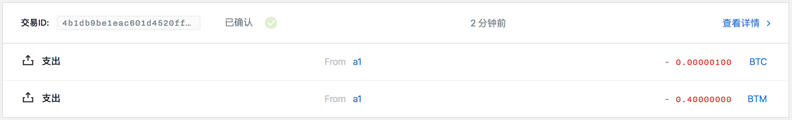
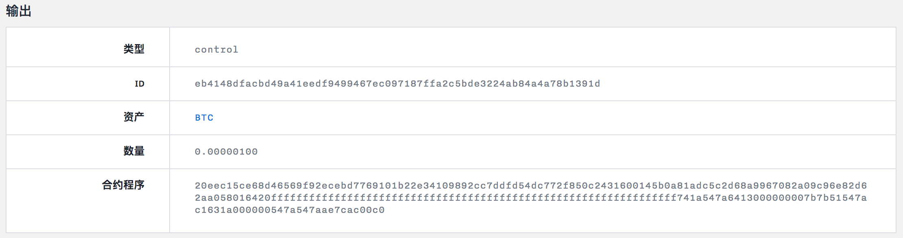
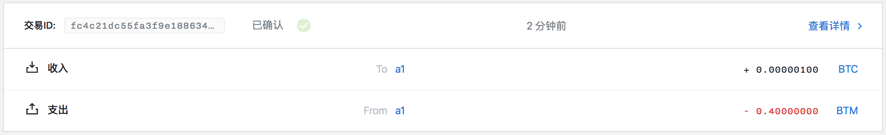
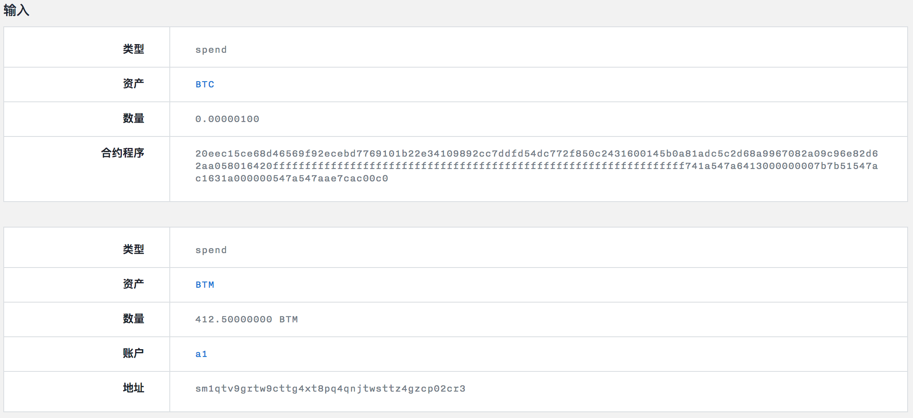
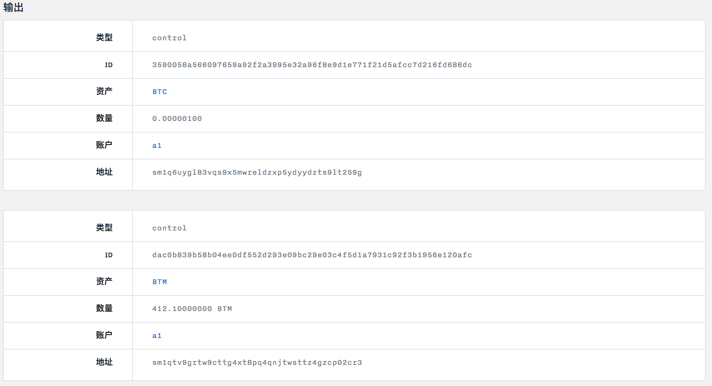

取消币币交易合约实例
=================

- [1 合约实例化](#1-合约实例化)
- [2 部署合约](#2-部署合约)
- [3 创建取消 HTLC 的交易](#3-创建取消-htlc-的交易)
- [4 对数据进行签名](#4-对数据进行签名)
  - [4.1 使用本地 api 签署](#41-使用本地-api-签署)
  - [4.2 使用命令行进行签署](#42-使用命令行进行签署)
- [5 发送交易](#5-发送交易)

## 1 合约实例化

首先币币交易合约如下：

```
contract TradeOffer(assetRequested: Asset,
                    amountRequested: Amount,
                    seller: Program,
                    cancelKey: PublicKey) locks valueAmount of valueAsset {
    clause trade() {
      lock amountRequested of assetRequested with seller
      unlock valueAmount of valueAsset
    }
    clause cancel(sellerSig: Signature) {
      verify checkTxSig(cancelKey, sellerSig)
      unlock valueAmount of valueAsset
    }
  }
```

对合约进行实例化：

```
$ swap equity contracts/tradeoff --instance ffffffffffffffffffffffffffffffffffffffffffffffffffffffffffffffff 100 00145b0a81adc5c2d68a9967082a09c96e82d62aa058 eec15ce68d46569f92ecebd7769101b22e34109892cc7ddfd54dc772f850c243
======= TradeOffer =======
Instantiated program:
20eec15ce68d46569f92ecebd7769101b22e34109892cc7ddfd54dc772f850c2431600145b0a81adc5c2d68a9967082a09c96e82d62aa058016420ffffffffffffffffffffffffffffffffffffffffffffffffffffffffffffffff741a547a6413000000007b7b51547ac1631a000000547a547aae7cac00c0
```

其中：

- contracts/tradeoff：币币交易合约所在目录。
- ffffffffffffffffffffffffffffffffffffffffffffffffffffffffffffffff：请求交易的资产 ID。
- 100：请求交易的资产数量。
- 00145b0a81adc5c2d68a9967082a09c96e82d62aa058：要获取合约锁定的资产，必须向该 00145b0a81adc5c2d68a9967082a09c96e82d62aa058 发送 100 个 ffffffffffffffffffffffffffffffffffffffffffffffffffffffffffffffff。
- eec15ce68d46569f92ecebd7769101b22e34109892cc7ddfd54dc772f850c243：能够取消币币交易合约的私钥所对应的公钥。

20eec15ce68d46569f92ecebd7769101b22e34109892cc7ddfd54dc772f850c2431600145b0a81adc5c2d68a9967082a09c96e82d62aa058016420ffffffffffffffffffffffffffffffffffffffffffffffffffffffffffffffff741a547a6413000000007b7b51547ac1631a000000547a547aae7cac00c0 就是币币交易合约实例化结果。

## 2 部署合约

部署合约详细过程参照[部署币币交易合约实例](./部署币币交易合约实例.md)。

构建合约：

```
$ swap deploytradeoff e18b91ba-91a5-4837-9d41-ce2b76cea81c bae7e17bb8f5d0cfbfd87a92f3204da082d388d4c9b10e8dcd36b3d0a18ceb3a 100 20eec15ce68d46569f92ecebd7769101b22e34109892cc7ddfd54dc772f850c2431600145b0a81adc5c2d68a9967082a09c96e82d62aa058016420ffffffffffffffffffffffffffffffffffffffffffffffffffffffffffffffff741a547a6413000000007b7b51547ac1631a000000547a547aae7cac00c0
buildTx: {"guid":"e18b91ba-91a5-4837-9d41-ce2b76cea81c","fee":40000000,"confirmations":1,"inputs":[{"type":"spend_wallet","asset":"bae7e17bb8f5d0cfbfd87a92f3204da082d388d4c9b10e8dcd36b3d0a18ceb3a","amount":100}],"outputs":[{"type":"control_program","amount":100,"asset":"bae7e17bb8f5d0cfbfd87a92f3204da082d388d4c9b10e8dcd36b3d0a18ceb3a","control_program":"20eec15ce68d46569f92ecebd7769101b22e34109892cc7ddfd54dc772f850c2431600145b0a81adc5c2d68a9967082a09c96e82d62aa058016420ffffffffffffffffffffffffffffffffffffffffffffffffffffffffffffffff741a547a6413000000007b7b51547ac1631a000000547a547aae7cac00c0"}]}
build tx result: {
	"raw_transaction": "07010002015c015aa44878d1504199f3c8a58c7f000ed71f12cc8bd7f36a0da8f57b49b283c3be4fbae7e17bb8f5d0cfbfd87a92f3204da082d388d4c9b10e8dcd36b3d0a18ceb3a6401011600145b0a81adc5c2d68a9967082a09c96e82d62aa058220120eec15ce68d46569f92ecebd7769101b22e34109892cc7ddfd54dc772f850c2430161015f2c94c2529a0aa865efe343d727ba78c0c1d3cad4f3237ba42bed1039d008aedbffffffffffffffffffffffffffffffffffffffffffffffffffffffffffffffff8099c4d5990100011600145b0a81adc5c2d68a9967082a09c96e82d62aa058220120eec15ce68d46569f92ecebd7769101b22e34109892cc7ddfd54dc772f850c24302019c01bae7e17bb8f5d0cfbfd87a92f3204da082d388d4c9b10e8dcd36b3d0a18ceb3a64017920eec15ce68d46569f92ecebd7769101b22e34109892cc7ddfd54dc772f850c2431600145b0a81adc5c2d68a9967082a09c96e82d62aa058016420ffffffffffffffffffffffffffffffffffffffffffffffffffffffffffffffff741a547a6413000000007b7b51547ac1631a000000547a547aae7cac00c000013effffffffffffffffffffffffffffffffffffffffffffffffffffffffffffffff80e5bac29901011600145b0a81adc5c2d68a9967082a09c96e82d62aa05800",
	"signing_instructions": [
		{
			"derivation_path": [
				"2c000000",
				"99000000",
				"01000000",
				"00000000",
				"01000000"
			],
			"sign_data": [
				"38d493e4e375723e7b0b07b062b25c9db454d56508bbbb31187a19c13644d07e"
			],
			"pubkey": "eec15ce68d46569f92ecebd7769101b22e34109892cc7ddfd54dc772f850c243"
		},
		{
			"derivation_path": [
				"2c000000",
				"99000000",
				"01000000",
				"00000000",
				"01000000"
			],
			"sign_data": [
				"bc86c92b87412c8ae591a971e921b7c066fd2bc4825c8a30dc71225608b5686d"
			],
			"pubkey": "eec15ce68d46569f92ecebd7769101b22e34109892cc7ddfd54dc772f850c243"
		}
	],
	"fee": 40000000
}
```

对合约数据进行签名：

post:

```json
{
    "address": "sm1qtv9grtw9cttg4xt8pq4qnjtwsttz4gzcp02cr3",
    "message": "38d493e4e375723e7b0b07b062b25c9db454d56508bbbb31187a19c13644d07e",
    "password": "12345"
}
```

response:

```json
{
    "status": "success",
    "data": {
        "signature": "87d3f2b1697acb1a51b01c43d4dd1bf73899b8a0bc8abf79d07f454926326694cbea506f8ed33d73aed2bec72980c0e35e656b53d77bf4f22f235b15167e710c",
        "derived_xpub": "eec15ce68d46569f92ecebd7769101b22e34109892cc7ddfd54dc772f850c243013095e747f609c86703ee7c0281b2182dfaca66d60ea58814d7929e6b6968a5"
    }
}
```

post:

```json
{
    "address": "sm1qtv9grtw9cttg4xt8pq4qnjtwsttz4gzcp02cr3",
    "message": "bc86c92b87412c8ae591a971e921b7c066fd2bc4825c8a30dc71225608b5686d",
    "password": "12345"
}
```

response:

```json
{
    "status": "success",
    "data": {
        "signature": "88d8ee53300826e0c42b1e8478b0b6310878a81b036210e919c5899449d5c3401be57efcf0c0fdc4b1629d4c235a007f2693646a8e01d1a3a8d1f236b56d330e",
        "derived_xpub": "eec15ce68d46569f92ecebd7769101b22e34109892cc7ddfd54dc772f850c243013095e747f609c86703ee7c0281b2182dfaca66d60ea58814d7929e6b6968a5"
    }
}
```

提交交易：

```
$ swap submit deploytradeoff e18b91ba-91a5-4837-9d41-ce2b76cea81c 07010002015c015aa44878d1504199f3c8a58c7f000ed71f12cc8bd7f36a0da8f57b49b283c3be4fbae7e17bb8f5d0cfbfd87a92f3204da082d388d4c9b10e8dcd36b3d0a18ceb3a6401011600145b0a81adc5c2d68a9967082a09c96e82d62aa058220120eec15ce68d46569f92ecebd7769101b22e34109892cc7ddfd54dc772f850c2430161015f2c94c2529a0aa865efe343d727ba78c0c1d3cad4f3237ba42bed1039d008aedbffffffffffffffffffffffffffffffffffffffffffffffffffffffffffffffff8099c4d5990100011600145b0a81adc5c2d68a9967082a09c96e82d62aa058220120eec15ce68d46569f92ecebd7769101b22e34109892cc7ddfd54dc772f850c24302019c01bae7e17bb8f5d0cfbfd87a92f3204da082d388d4c9b10e8dcd36b3d0a18ceb3a64017920eec15ce68d46569f92ecebd7769101b22e34109892cc7ddfd54dc772f850c2431600145b0a81adc5c2d68a9967082a09c96e82d62aa058016420ffffffffffffffffffffffffffffffffffffffffffffffffffffffffffffffff741a547a6413000000007b7b51547ac1631a000000547a547aae7cac00c000013effffffffffffffffffffffffffffffffffffffffffffffffffffffffffffffff80e5bac29901011600145b0a81adc5c2d68a9967082a09c96e82d62aa05800 87d3f2b1697acb1a51b01c43d4dd1bf73899b8a0bc8abf79d07f454926326694cbea506f8ed33d73aed2bec72980c0e35e656b53d77bf4f22f235b15167e710c 88d8ee53300826e0c42b1e8478b0b6310878a81b036210e919c5899449d5c3401be57efcf0c0fdc4b1629d4c235a007f2693646a8e01d1a3a8d1f236b56d330e

submitPayment: {
	"guid": "e18b91ba-91a5-4837-9d41-ce2b76cea81c",
	"raw_transaction": "07010002015c015aa44878d1504199f3c8a58c7f000ed71f12cc8bd7f36a0da8f57b49b283c3be4fbae7e17bb8f5d0cfbfd87a92f3204da082d388d4c9b10e8dcd36b3d0a18ceb3a6401011600145b0a81adc5c2d68a9967082a09c96e82d62aa058220120eec15ce68d46569f92ecebd7769101b22e34109892cc7ddfd54dc772f850c2430161015f2c94c2529a0aa865efe343d727ba78c0c1d3cad4f3237ba42bed1039d008aedbffffffffffffffffffffffffffffffffffffffffffffffffffffffffffffffff8099c4d5990100011600145b0a81adc5c2d68a9967082a09c96e82d62aa058220120eec15ce68d46569f92ecebd7769101b22e34109892cc7ddfd54dc772f850c24302019c01bae7e17bb8f5d0cfbfd87a92f3204da082d388d4c9b10e8dcd36b3d0a18ceb3a64017920eec15ce68d46569f92ecebd7769101b22e34109892cc7ddfd54dc772f850c2431600145b0a81adc5c2d68a9967082a09c96e82d62aa058016420ffffffffffffffffffffffffffffffffffffffffffffffffffffffffffffffff741a547a6413000000007b7b51547ac1631a000000547a547aae7cac00c000013effffffffffffffffffffffffffffffffffffffffffffffffffffffffffffffff80e5bac29901011600145b0a81adc5c2d68a9967082a09c96e82d62aa05800",
	"signatures": [
		[
			"87d3f2b1697acb1a51b01c43d4dd1bf73899b8a0bc8abf79d07f454926326694cbea506f8ed33d73aed2bec72980c0e35e656b53d77bf4f22f235b15167e710c"
		],
		[
			"88d8ee53300826e0c42b1e8478b0b6310878a81b036210e919c5899449d5c3401be57efcf0c0fdc4b1629d4c235a007f2693646a8e01d1a3a8d1f236b56d330e"
		]
	],
	"memo": ""
}
submit deploytradeoff tx result: 4b1db9be1eac601d4520fffae24472060b1fb6641d3e121fa8e3c0995ed91e3d
```



查询得到锁定到合约的 UTXO ID 为 eb4148dfacbd49a41eedf9499467ec097187ffa2c5bde3224ab84a4a78b1391d。



## 3 创建取消 HTLC 的交易

```
$ swap canceltradeoff -h
cancel tradeoff contract

Usage:
  swap canceltradeoff <guid> <contractUTXOID> <lockedAsset> <lockedAmount> <receiver> [URL flags(ip and port)] [flags]

Flags:
  -h, --help          help for canceltradeoff
      --ip string     network address (default "127.0.0.1")
      --port string   network port (default "9888")
```

```
$ swap canceltradeoff e18b91ba-91a5-4837-9d41-ce2b76cea81c eb4148dfacbd49a41eedf9499467ec097187ffa2c5bde3224ab84a4a78b1391d bae7e17bb8f5d0cfbfd87a92f3204da082d388d4c9b10e8dcd36b3d0a18ceb3a 100 sm1q6uygl83vqs9x5mwreldzxp5ydyydzts9lt259g
build unlocked contract tx: {"guid":"e18b91ba-91a5-4837-9d41-ce2b76cea81c","fee":40000000,"confirmations":1,"inputs":[{"type":"spend_utxo","output_id":"eb4148dfacbd49a41eedf9499467ec097187ffa2c5bde3224ab84a4a78b1391d"}],"outputs":[{"type":"control_address","amount":100,"asset":"bae7e17bb8f5d0cfbfd87a92f3204da082d388d4c9b10e8dcd36b3d0a18ceb3a","address":"sm1q6uygl83vqs9x5mwreldzxp5ydyydzts9lt259g"}]}
build call htlc tx result: {
	"raw_transaction": "0701000201c00101bd0108bd250ef976bfcf6f45d783b9e296c1404835c9129b0549d9d919322bb8b320bae7e17bb8f5d0cfbfd87a92f3204da082d388d4c9b10e8dcd36b3d0a18ceb3a6400017920eec15ce68d46569f92ecebd7769101b22e34109892cc7ddfd54dc772f850c2431600145b0a81adc5c2d68a9967082a09c96e82d62aa058016420ffffffffffffffffffffffffffffffffffffffffffffffffffffffffffffffff741a547a6413000000007b7b51547ac1631a000000547a547aae7cac00c001000161015f8624979067187381d0c7eca54f9754a0e656483d8f6d3e11dadf24b30be40625ffffffffffffffffffffffffffffffffffffffffffffffffffffffffffffffff8099c4d5990100011600145b0a81adc5c2d68a9967082a09c96e82d62aa058220120eec15ce68d46569f92ecebd7769101b22e34109892cc7ddfd54dc772f850c243020139bae7e17bb8f5d0cfbfd87a92f3204da082d388d4c9b10e8dcd36b3d0a18ceb3a6401160014d7088f9e2c040a6a6dc3cfda2306846908d12e0500013effffffffffffffffffffffffffffffffffffffffffffffffffffffffffffffff80e5bac29901011600145b0a81adc5c2d68a9967082a09c96e82d62aa05800",
	"signing_instructions": [
		{
			"derivation_path": null,
			"sign_data": [
				"c5d381c28b03f9b2dfa5fc22ae7ab146f9ca638fa43f60ae57f8e19ece0a61a5"
			]
		},
		{
			"derivation_path": [
				"2c000000",
				"99000000",
				"01000000",
				"00000000",
				"01000000"
			],
			"sign_data": [
				"7ec2742677bd8b2e553c212680eb66b37ef16c5d2e35f74dc1a7fe1fbda421f2"
			],
			"pubkey": "eec15ce68d46569f92ecebd7769101b22e34109892cc7ddfd54dc772f850c243"
		}
	],
	"fee": 40000000
}
```

其中：

- e18b91ba-91a5-4837-9d41-ce2b76cea81c：用户的 guid
- eb4148dfacbd49a41eedf9499467ec097187ffa2c5bde3224ab84a4a78b1391d：调用的 UTXO ID
- bae7e17bb8f5d0cfbfd87a92f3204da082d388d4c9b10e8dcd36b3d0a18ceb3a：锁定到合约的资产 ID
- 100：锁定资产的数量
- sm1q6uygl83vqs9x5mwreldzxp5ydyydzts9lt259g：接收解锁资产的用户地址

对 raw_transaction 进行解析：

```
$ bytomcli decode-raw-transaction 0701000201c00101bd0108bd250ef976bfcf6f45d783b9e296c1404835c9129b0549d9d919322bb8b320bae7e17bb8f5d0cfbfd87a92f3204da082d388d4c9b10e8dcd36b3d0a18ceb3a6400017920eec15ce68d46569f92ecebd7769101b22e34109892cc7ddfd54dc772f850c2431600145b0a81adc5c2d68a9967082a09c96e82d62aa058016420ffffffffffffffffffffffffffffffffffffffffffffffffffffffffffffffff741a547a6413000000007b7b51547ac1631a000000547a547aae7cac00c001000161015f8624979067187381d0c7eca54f9754a0e656483d8f6d3e11dadf24b30be40625ffffffffffffffffffffffffffffffffffffffffffffffffffffffffffffffff8099c4d5990100011600145b0a81adc5c2d68a9967082a09c96e82d62aa058220120eec15ce68d46569f92ecebd7769101b22e34109892cc7ddfd54dc772f850c243020139bae7e17bb8f5d0cfbfd87a92f3204da082d388d4c9b10e8dcd36b3d0a18ceb3a6401160014d7088f9e2c040a6a6dc3cfda2306846908d12e0500013effffffffffffffffffffffffffffffffffffffffffffffffffffffffffffffff80e5bac29901011600145b0a81adc5c2d68a9967082a09c96e82d62aa05800
```

```json
{
  "fee": 40000000,
  "inputs": [
    {
      "amount": 100,
      "asset_definition": {},
      "asset_id": "bae7e17bb8f5d0cfbfd87a92f3204da082d388d4c9b10e8dcd36b3d0a18ceb3a",
      "control_program": "20eec15ce68d46569f92ecebd7769101b22e34109892cc7ddfd54dc772f850c2431600145b0a81adc5c2d68a9967082a09c96e82d62aa058016420ffffffffffffffffffffffffffffffffffffffffffffffffffffffffffffffff741a547a6413000000007b7b51547ac1631a000000547a547aae7cac00c0",
      "input_id": "93b1cac9c5268b52e6dce7cd41ae8dab5698f0f4c598afc196eeb2a410729f35",
      "sign_data": "c5d381c28b03f9b2dfa5fc22ae7ab146f9ca638fa43f60ae57f8e19ece0a61a5",
      "spent_output_id": "eb4148dfacbd49a41eedf9499467ec097187ffa2c5bde3224ab84a4a78b1391d",
      "type": "spend",
      "witness_arguments": null
    },
    {
      "address": "sm1qtv9grtw9cttg4xt8pq4qnjtwsttz4gzcp02cr3",
      "amount": 41250000000,
      "asset_definition": {},
      "asset_id": "ffffffffffffffffffffffffffffffffffffffffffffffffffffffffffffffff",
      "control_program": "00145b0a81adc5c2d68a9967082a09c96e82d62aa058",
      "input_id": "4eedc944ead08f740a2664f45b71d7319ff003612144d973660e537ffd8878da",
      "sign_data": "7ec2742677bd8b2e553c212680eb66b37ef16c5d2e35f74dc1a7fe1fbda421f2",
      "spent_output_id": "401ecf3f1e94899c3c8b144c5c3f16745bda034f5ade492d743217016f6d7168",
      "type": "spend",
      "witness_arguments": [
        "eec15ce68d46569f92ecebd7769101b22e34109892cc7ddfd54dc772f850c243"
      ]
    }
  ],
  "outputs": [
    {
      "address": "sm1q6uygl83vqs9x5mwreldzxp5ydyydzts9lt259g",
      "amount": 100,
      "asset_definition": {},
      "asset_id": "bae7e17bb8f5d0cfbfd87a92f3204da082d388d4c9b10e8dcd36b3d0a18ceb3a",
      "control_program": "0014d7088f9e2c040a6a6dc3cfda2306846908d12e05",
      "id": "3590058a566097659a92f2a3995e32a96f8e9d1e771f21d5afcc7d216fd686dc",
      "position": 0,
      "type": "control"
    },
    {
      "address": "sm1qtv9grtw9cttg4xt8pq4qnjtwsttz4gzcp02cr3",
      "amount": 41210000000,
      "asset_definition": {},
      "asset_id": "ffffffffffffffffffffffffffffffffffffffffffffffffffffffffffffffff",
      "control_program": "00145b0a81adc5c2d68a9967082a09c96e82d62aa058",
      "id": "dac0b839b58b04ee0df552d293e09bc29e03c4f5d1a7931c92f3b1956e120afc",
      "position": 1,
      "type": "control"
    }
  ],
  "size": 461,
  "time_range": 0,
  "tx_id": "fc4c21dc55fa3f9e1886347e392b5c13ea8e30f6da28b843a25c5cca042554b8",
  "version": 1
}
```

## 4 对数据进行签名

需要签名的数据有两个：

- c5d381c28b03f9b2dfa5fc22ae7ab146f9ca638fa43f60ae57f8e19ece0a61a5
- 7ec2742677bd8b2e553c212680eb66b37ef16c5d2e35f74dc1a7fe1fbda421f2

有两种数据签名方法，可任选其一。

### 4.1 使用本地 api 签署

调用 127.0.0.1:9888/sign-message api 对 c5d381c28b03f9b2dfa5fc22ae7ab146f9ca638fa43f60ae57f8e19ece0a61a5 进行签名：

post:

```json
{
    "address": "sm1qtv9grtw9cttg4xt8pq4qnjtwsttz4gzcp02cr3",
    "message": "c5d381c28b03f9b2dfa5fc22ae7ab146f9ca638fa43f60ae57f8e19ece0a61a5",
    "password": "12345"
}
```

对合约进行解锁的时候，因为 cancelKey 公钥对应的地址是账户 a1 的地址 sm1qtv9grtw9cttg4xt8pq4qnjtwsttz4gzcp02cr3，所以调用该函数对数据进行签名。

response:

```json
{
    "status": "success",
    "data": {
        "signature": "e11cf8bead0bf60115cab50ef09d20d890522ce1386522b37a783bd29910e21a5b81045777a847442aa0f5fea60c3fc7eeb159883d6493430a269130d818a406",
        "derived_xpub": "eec15ce68d46569f92ecebd7769101b22e34109892cc7ddfd54dc772f850c243013095e747f609c86703ee7c0281b2182dfaca66d60ea58814d7929e6b6968a5"
    }
}
```

调用 127.0.0.1:9888/sign-message api 对 7ec2742677bd8b2e553c212680eb66b37ef16c5d2e35f74dc1a7fe1fbda421f2 进行签名：

post:

```json
{
    "address": "sm1qtv9grtw9cttg4xt8pq4qnjtwsttz4gzcp02cr3",
    "message": "7ec2742677bd8b2e553c212680eb66b37ef16c5d2e35f74dc1a7fe1fbda421f2",
    "password": "12345"
}
```

response:

```json
{
    "status": "success",
    "data": {
        "signature": "a070ca8a5344f8e41c03493f8167db4fcac0b4c90b0a77f4b6cd3b3396601189c2a3eb844c249362aaf81001c0abfe70637a491996131fb119919901a6aec30a",
        "derived_xpub": "eec15ce68d46569f92ecebd7769101b22e34109892cc7ddfd54dc772f850c243013095e747f609c86703ee7c0281b2182dfaca66d60ea58814d7929e6b6968a5"
    }
}
```

### 4.2 使用命令行进行签署

```
$ swap sign -h
sign message

Usage:
  swap sign <xprv> <message> [flags]

Flags:
  -h, --help   help for sign
```

```
$ swap sign 682d87647c76edafb0c0bdb8b9a87e84f79627c86a4d7620c89a9ef7551ecf47013095e747f609c86703ee7c0281b2182dfaca66d60ea58814d7929e6b6968a5 c5d381c28b03f9b2dfa5fc22ae7ab146f9ca638fa43f60ae57f8e19ece0a61a5

sign result:
xprv: 682d87647c76edafb0c0bdb8b9a87e84f79627c86a4d7620c89a9ef7551ecf47013095e747f609c86703ee7c0281b2182dfaca66d60ea58814d7929e6b6968a5
message: c5d381c28b03f9b2dfa5fc22ae7ab146f9ca638fa43f60ae57f8e19ece0a61a5
signature: e11cf8bead0bf60115cab50ef09d20d890522ce1386522b37a783bd29910e21a5b81045777a847442aa0f5fea60c3fc7eeb159883d6493430a269130d818a406
```

其中：

- 682d87647c76edafb0c0bdb8b9a87e84f79627c86a4d7620c89a9ef7551ecf47013095e747f609c86703ee7c0281b2182dfaca66d60ea58814d7929e6b6968a5：账户 a1 的扩展私钥，因为账户 a1 需要取消币币交易合约，则取消的时候需要验证合约中 cancelKey 对应的签名。
- c5d381c28b03f9b2dfa5fc22ae7ab146f9ca638fa43f60ae57f8e19ece0a61a5：需要签名的数据。

```
$ swap sign 682d87647c76edafb0c0bdb8b9a87e84f79627c86a4d7620c89a9ef7551ecf47013095e747f609c86703ee7c0281b2182dfaca66d60ea58814d7929e6b6968a5 7ec2742677bd8b2e553c212680eb66b37ef16c5d2e35f74dc1a7fe1fbda421f2

sign result:
xprv: 682d87647c76edafb0c0bdb8b9a87e84f79627c86a4d7620c89a9ef7551ecf47013095e747f609c86703ee7c0281b2182dfaca66d60ea58814d7929e6b6968a5
message: 7ec2742677bd8b2e553c212680eb66b37ef16c5d2e35f74dc1a7fe1fbda421f2
signature: a070ca8a5344f8e41c03493f8167db4fcac0b4c90b0a77f4b6cd3b3396601189c2a3eb844c249362aaf81001c0abfe70637a491996131fb119919901a6aec30a
```

## 5 发送交易

```
$ swap submit -h
submit a payment

Usage:
  swap submit <action> <guid> <rawTx> [spend parameters] [URL flags(ip and port)] [flags]

Flags:
  -h, --help          help for submit
      --ip string     network address (default "127.0.0.1")
      --port string   network port (default "3000")
```

```
$ swap submit canceltradeoff e18b91ba-91a5-4837-9d41-ce2b76cea81c 0701000201c00101bd0108bd250ef976bfcf6f45d783b9e296c1404835c9129b0549d9d919322bb8b320bae7e17bb8f5d0cfbfd87a92f3204da082d388d4c9b10e8dcd36b3d0a18ceb3a6400017920eec15ce68d46569f92ecebd7769101b22e34109892cc7ddfd54dc772f850c2431600145b0a81adc5c2d68a9967082a09c96e82d62aa058016420ffffffffffffffffffffffffffffffffffffffffffffffffffffffffffffffff741a547a6413000000007b7b51547ac1631a000000547a547aae7cac00c001000161015f8624979067187381d0c7eca54f9754a0e656483d8f6d3e11dadf24b30be40625ffffffffffffffffffffffffffffffffffffffffffffffffffffffffffffffff8099c4d5990100011600145b0a81adc5c2d68a9967082a09c96e82d62aa058220120eec15ce68d46569f92ecebd7769101b22e34109892cc7ddfd54dc772f850c243020139bae7e17bb8f5d0cfbfd87a92f3204da082d388d4c9b10e8dcd36b3d0a18ceb3a6401160014d7088f9e2c040a6a6dc3cfda2306846908d12e0500013effffffffffffffffffffffffffffffffffffffffffffffffffffffffffffffff80e5bac29901011600145b0a81adc5c2d68a9967082a09c96e82d62aa05800 e11cf8bead0bf60115cab50ef09d20d890522ce1386522b37a783bd29910e21a5b81045777a847442aa0f5fea60c3fc7eeb159883d6493430a269130d818a406 a070ca8a5344f8e41c03493f8167db4fcac0b4c90b0a77f4b6cd3b3396601189c2a3eb844c249362aaf81001c0abfe70637a491996131fb119919901a6aec30a

submitPayment: {
	"guid": "e18b91ba-91a5-4837-9d41-ce2b76cea81c",
	"raw_transaction": "0701000201c00101bd0108bd250ef976bfcf6f45d783b9e296c1404835c9129b0549d9d919322bb8b320bae7e17bb8f5d0cfbfd87a92f3204da082d388d4c9b10e8dcd36b3d0a18ceb3a6400017920eec15ce68d46569f92ecebd7769101b22e34109892cc7ddfd54dc772f850c2431600145b0a81adc5c2d68a9967082a09c96e82d62aa058016420ffffffffffffffffffffffffffffffffffffffffffffffffffffffffffffffff741a547a6413000000007b7b51547ac1631a000000547a547aae7cac00c001000161015f8624979067187381d0c7eca54f9754a0e656483d8f6d3e11dadf24b30be40625ffffffffffffffffffffffffffffffffffffffffffffffffffffffffffffffff8099c4d5990100011600145b0a81adc5c2d68a9967082a09c96e82d62aa058220120eec15ce68d46569f92ecebd7769101b22e34109892cc7ddfd54dc772f850c243020139bae7e17bb8f5d0cfbfd87a92f3204da082d388d4c9b10e8dcd36b3d0a18ceb3a6401160014d7088f9e2c040a6a6dc3cfda2306846908d12e0500013effffffffffffffffffffffffffffffffffffffffffffffffffffffffffffffff80e5bac29901011600145b0a81adc5c2d68a9967082a09c96e82d62aa05800",
	"signatures": [
		[
			"e11cf8bead0bf60115cab50ef09d20d890522ce1386522b37a783bd29910e21a5b81045777a847442aa0f5fea60c3fc7eeb159883d6493430a269130d818a406",
			"01"
		],
		[
			"a070ca8a5344f8e41c03493f8167db4fcac0b4c90b0a77f4b6cd3b3396601189c2a3eb844c249362aaf81001c0abfe70637a491996131fb119919901a6aec30a"
		]
	],
	"memo": ""
}
submit canceltradeoff tx result: fc4c21dc55fa3f9e1886347e392b5c13ea8e30f6da28b843a25c5cca042554b8
```

其中：

- cancelhtlc：提交的交易类型是取消 HTLC 合约。
- e18b91ba-91a5-4837-9d41-ce2b76cea81c：用户的 guid。
- 0701000201c00101bd0108bd250ef976bfcf6f45d783b9e296c1404835c9129b0549d9d919322bb8b320bae7e17bb8f5d0cfbfd87a92f3204da082d388d4c9b10e8dcd36b3d0a18ceb3a6400017920eec15ce68d46569f92ecebd7769101b22e34109892cc7ddfd54dc772f850c2431600145b0a81adc5c2d68a9967082a09c96e82d62aa058016420ffffffffffffffffffffffffffffffffffffffffffffffffffffffffffffffff741a547a6413000000007b7b51547ac1631a000000547a547aae7cac00c001000161015f8624979067187381d0c7eca54f9754a0e656483d8f6d3e11dadf24b30be40625ffffffffffffffffffffffffffffffffffffffffffffffffffffffffffffffff8099c4d5990100011600145b0a81adc5c2d68a9967082a09c96e82d62aa058220120eec15ce68d46569f92ecebd7769101b22e34109892cc7ddfd54dc772f850c243020139bae7e17bb8f5d0cfbfd87a92f3204da082d388d4c9b10e8dcd36b3d0a18ceb3a6401160014d7088f9e2c040a6a6dc3cfda2306846908d12e0500013effffffffffffffffffffffffffffffffffffffffffffffffffffffffffffffff80e5bac29901011600145b0a81adc5c2d68a9967082a09c96e82d62aa05800：构建的原始交易数据。
- e11cf8bead0bf60115cab50ef09d20d890522ce1386522b37a783bd29910e21a5b81045777a847442aa0f5fea60c3fc7eeb159883d6493430a269130d818a406：解锁合约需要的签名。
- a070ca8a5344f8e41c03493f8167db4fcac0b4c90b0a77f4b6cd3b3396601189c2a3eb844c249362aaf81001c0abfe70637a491996131fb119919901a6aec30a：支付手续费需要的签名。

参数中 “01” 表示需要执行合约的第二个语句，即取消合约的语句。







锁定到合约的资产返回到账户 a1 的 sm1q6uygl83vqs9x5mwreldzxp5ydyydzts9lt259g。
