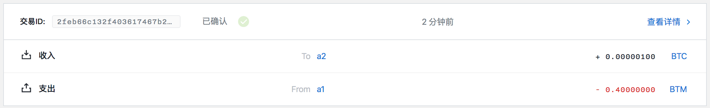

调用 HTLC 实例
==============

- [1 构建解锁合约交易](#1-构建解锁合约交易)
- [2 对消息进行签名](#2-对消息进行签名)
  - [2.1 使用本地 api 签署](#21-使用本地-api-签署)
  - [2.2 使用命令行进行签署](#22-使用命令行进行签署)
- [3 提交解锁交易](#3-提交解锁交易)

## 1 构建解锁合约交易

```
$ swap callhtlc -h
call HTLC contract

Usage:
  swap callhtlc <guid> <contractUTXOID> <contractAsset> <contractAmount> <receiver> [URL flags(ip and port)] [flags]

Flags:
  -h, --help          help for callhtlc
      --ip string     network address (default "127.0.0.1")
      --port string   network port (default "9888")
```

其中：

- guid：用户 guid
- contractUTXOID：合约 UTXO ID
- contractAsset：锁定到合约的资金
- contractAmount：锁定到合约的资金数量
- receiver：收取合约资产的地址

构建解锁交易：

```
$ swap callhtlc e18b91ba-91a5-4837-9d41-ce2b76cea81c dde4198542ec1904dbfa026c16987e4181c2dd7ceb826900a25ec119613c36d1 bae7e17bb8f5d0cfbfd87a92f3204da082d388d4c9b10e8dcd36b3d0a18ceb3a 100 sm1qpl0wzzz585c9xzqfwqvuaddwc0dxpmrxzp56s5
build unlocked contract tx: {"guid":"e18b91ba-91a5-4837-9d41-ce2b76cea81c","fee":40000000,"confirmations":1,"inputs":[{"type":"spend_utxo","output_id":"dde4198542ec1904dbfa026c16987e4181c2dd7ceb826900a25ec119613c36d1"}],"outputs":[{"type":"control_address","amount":100,"asset":"bae7e17bb8f5d0cfbfd87a92f3204da082d388d4c9b10e8dcd36b3d0a18ceb3a","address":"sm1qpl0wzzz585c9xzqfwqvuaddwc0dxpmrxzp56s5"}]}
build call htlc tx result: {
	"raw_transaction": "0701000201d30101d001793cb3a004114b12ab0117514a556dd9934b1ccc1c412064065b69981215ec7ebae7e17bb8f5d0cfbfd87a92f3204da082d388d4c9b10e8dcd36b3d0a18ceb3a6400018b01202cf24dba5fb0a30e26e83b2ac5b9e29e1b161e5c1fa7425e73043362938b98240164206ea28f3f1389efd6a731de070fb38ab69dc93dae6c73b6524bac901b662f601d20eec15ce68d46569f92ecebd7769101b22e34109892cc7ddfd54dc772f850c2437422547a6418000000557aa8547a88537a7bae7cac63220000007bcd9f69537a7cae7cac00c001000161015ff1a625daa82c4f3cb933b778d8afe1dcd2e70693d8fbe8b97822316f9a34322bffffffffffffffffffffffffffffffffffffffffffffffffffffffffffffffff8099c4d5990100011600145b0a81adc5c2d68a9967082a09c96e82d62aa058220120eec15ce68d46569f92ecebd7769101b22e34109892cc7ddfd54dc772f850c243020139bae7e17bb8f5d0cfbfd87a92f3204da082d388d4c9b10e8dcd36b3d0a18ceb3a64011600140fdee108543d305308097019ceb5aec3da60ec6600013effffffffffffffffffffffffffffffffffffffffffffffffffffffffffffffff80e5bac29901011600145b0a81adc5c2d68a9967082a09c96e82d62aa05800",
	"signing_instructions": [
		{
			"derivation_path": null,
			"sign_data": [
				"e83506ee6efef538d79be1ac5dece8c158fbfabd5a3bda30a31013c141d9aa19"
			]
		},
		{
			"derivation_path": [
				"2c000000",
				"99000000",
				"01000000",
				"00000000",
				"01000000"
			],
			"sign_data": [
				"6b88a219efd71bc3679da4acc9e3adbfbce437281feddee363f973b400f1b893"
			],
			"pubkey": "eec15ce68d46569f92ecebd7769101b22e34109892cc7ddfd54dc772f850c243"
		}
	],
	"fee": 40000000
}
```

其中：

- e18b91ba-91a5-4837-9d41-ce2b76cea81c：用户 guid
- dde4198542ec1904dbfa026c16987e4181c2dd7ceb826900a25ec119613c36d1：合约 UTXO ID
- bae7e17bb8f5d0cfbfd87a92f3204da082d388d4c9b10e8dcd36b3d0a18ceb3a：锁定到合约的资金
- 100：锁定到合约的资金数量
- sm1qpl0wzzz585c9xzqfwqvuaddwc0dxpmrxzp56s5：收取合约资产的地址

对 raw_transaction 进行解析：

```
$ bytomcli decode-raw-transaction 0701000201d30101d001793cb3a004114b12ab0117514a556dd9934b1ccc1c412064065b69981215ec7ebae7e17bb8f5d0cfbfd87a92f3204da082d388d4c9b10e8dcd36b3d0a18ceb3a6400018b01202cf24dba5fb0a30e26e83b2ac5b9e29e1b161e5c1fa7425e73043362938b98240164206ea28f3f1389efd6a731de070fb38ab69dc93dae6c73b6524bac901b662f601d20eec15ce68d46569f92ecebd7769101b22e34109892cc7ddfd54dc772f850c2437422547a6418000000557aa8547a88537a7bae7cac63220000007bcd9f69537a7cae7cac00c001000161015ff1a625daa82c4f3cb933b778d8afe1dcd2e70693d8fbe8b97822316f9a34322bffffffffffffffffffffffffffffffffffffffffffffffffffffffffffffffff8099c4d5990100011600145b0a81adc5c2d68a9967082a09c96e82d62aa058220120eec15ce68d46569f92ecebd7769101b22e34109892cc7ddfd54dc772f850c243020139bae7e17bb8f5d0cfbfd87a92f3204da082d388d4c9b10e8dcd36b3d0a18ceb3a64011600140fdee108543d305308097019ceb5aec3da60ec6600013effffffffffffffffffffffffffffffffffffffffffffffffffffffffffffffff80e5bac29901011600145b0a81adc5c2d68a9967082a09c96e82d62aa05800
```

```json
{
  "fee": 40000000,
  "inputs": [
    {
      "amount": 100,
      "asset_definition": {},
      "asset_id": "bae7e17bb8f5d0cfbfd87a92f3204da082d388d4c9b10e8dcd36b3d0a18ceb3a",
      "control_program": "202cf24dba5fb0a30e26e83b2ac5b9e29e1b161e5c1fa7425e73043362938b98240164206ea28f3f1389efd6a731de070fb38ab69dc93dae6c73b6524bac901b662f601d20eec15ce68d46569f92ecebd7769101b22e34109892cc7ddfd54dc772f850c2437422547a6418000000557aa8547a88537a7bae7cac63220000007bcd9f69537a7cae7cac00c0",
      "input_id": "a2bca3fbae85d11f64932902fd3e65cb080dda92f06d90b731e7a050b3ea0ef7",
      "sign_data": "e83506ee6efef538d79be1ac5dece8c158fbfabd5a3bda30a31013c141d9aa19",
      "spent_output_id": "dde4198542ec1904dbfa026c16987e4181c2dd7ceb826900a25ec119613c36d1",
      "type": "spend",
      "witness_arguments": null
    },
    {
      "address": "sm1qtv9grtw9cttg4xt8pq4qnjtwsttz4gzcp02cr3",
      "amount": 41250000000,
      "asset_definition": {},
      "asset_id": "ffffffffffffffffffffffffffffffffffffffffffffffffffffffffffffffff",
      "control_program": "00145b0a81adc5c2d68a9967082a09c96e82d62aa058",
      "input_id": "e345030511e25746e8c114e25c6d1f50f999cec2c4c8df97c2426c7cd66dfecd",
      "sign_data": "6b88a219efd71bc3679da4acc9e3adbfbce437281feddee363f973b400f1b893",
      "spent_output_id": "2ae8ab4cd505d0654fcbe6bdee1d7b3a76aee32dd3c102611d22adab6e65ff7c",
      "type": "spend",
      "witness_arguments": [
        "eec15ce68d46569f92ecebd7769101b22e34109892cc7ddfd54dc772f850c243"
      ]
    }
  ],
  "outputs": [
    {
      "address": "sm1qpl0wzzz585c9xzqfwqvuaddwc0dxpmrxzp56s5",
      "amount": 100,
      "asset_definition": {},
      "asset_id": "bae7e17bb8f5d0cfbfd87a92f3204da082d388d4c9b10e8dcd36b3d0a18ceb3a",
      "control_program": "00140fdee108543d305308097019ceb5aec3da60ec66",
      "id": "4a2649347fc48f9f20052bf360bee8d147d3519f93ee32ea6163dd6eb24b196d",
      "position": 0,
      "type": "control"
    },
    {
      "address": "sm1qtv9grtw9cttg4xt8pq4qnjtwsttz4gzcp02cr3",
      "amount": 41210000000,
      "asset_definition": {},
      "asset_id": "ffffffffffffffffffffffffffffffffffffffffffffffffffffffffffffffff",
      "control_program": "00145b0a81adc5c2d68a9967082a09c96e82d62aa058",
      "id": "e661a23273076ff9ef3982e1a7a2a19de298e354c8f17b3f3032430998454e4c",
      "position": 1,
      "type": "control"
    }
  ],
  "size": 480,
  "time_range": 0,
  "tx_id": "2feb66c132f403617467b2d4c97f27cbd6585c5fbf8fdec3a2594f00a1df73da",
  "version": 1
}
```

## 2 对消息进行签名

需要签名的 sign_data 为：

- e83506ee6efef538d79be1ac5dece8c158fbfabd5a3bda30a31013c141d9aa19
- 6b88a219efd71bc3679da4acc9e3adbfbce437281feddee363f973b400f1b893

对数据进行签署的方法有两种，可任取其一。

### 2.1 使用本地 api 签署

调用 127.0.0.1:9888/sign-message api 对 e83506ee6efef538d79be1ac5dece8c158fbfabd5a3bda30a31013c141d9aa19 进行签名：

post:

```json
{
    "address": "sm1qpl0wzzz585c9xzqfwqvuaddwc0dxpmrxzp56s5",
    "message": "e83506ee6efef538d79be1ac5dece8c158fbfabd5a3bda30a31013c141d9aa19",
    "password": "12345"
}
```

对合约进行解锁的时候，因为 recipient 公钥对应的地址是账户 a2 的地址 sm1qpl0wzzz585c9xzqfwqvuaddwc0dxpmrxzp56s5，所以调用该函数对数据进行签名。

response:

```json
{
    "status": "success",
    "data": {
        "signature": "618650b3d5090b33763e1273d2b216e6095b41c4a77d48a47eb4c008b9adb39f424eed34a5e7b9adf84574c89c01e30b4b9ddb67d4d0a45183fc66a5b448010c",
        "derived_xpub": "6ea28f3f1389efd6a731de070fb38ab69dc93dae6c73b6524bac901b662f601d10d834f4b58c6d01ae38f89e9a3f654afe11bbb2c5ec194a31fbf7908cb72655"
    }
}
```

调用 127.0.0.1:9888/sign-message api 对 6b88a219efd71bc3679da4acc9e3adbfbce437281feddee363f973b400f1b893 进行签名：

post:

```json
{
    "address": "sm1qtv9grtw9cttg4xt8pq4qnjtwsttz4gzcp02cr3",
    "message": "6b88a219efd71bc3679da4acc9e3adbfbce437281feddee363f973b400f1b893",
    "password": "12345"
}
```

response:

```json
{
    "status": "success",
    "data": {
        "signature": "ed4fd50da86cbe243868e1881b51a7ad94ea3ec69e069131b9ad74c05216568db286c76d33b3b19b5963795d66d2e2f7420ab6e555a4e54b134cf91c782b1900",
        "derived_xpub": "eec15ce68d46569f92ecebd7769101b22e34109892cc7ddfd54dc772f850c243013095e747f609c86703ee7c0281b2182dfaca66d60ea58814d7929e6b6968a5"
    }
}
```

### 2.2 使用命令行进行签署

```
$ swap sign -h
sign message

Usage:
  swap sign <xprv> <message> [flags]

Flags:
  -h, --help   help for sign
```

对合约进行解锁的时候，因为 recipient 公钥对应的地址是账户 a2 的地址 sm1qpl0wzzz585c9xzqfwqvuaddwc0dxpmrxzp56s5，对应的派生私钥是 9097e6bbe3fe1bdb0d2d7e0391f6e17ca66d2b33d56920af13ad16b52c9b464d10d834f4b58c6d01ae38f89e9a3f654afe11bbb2c5ec194a31fbf7908cb72655。

```
$ swap sign 9097e6bbe3fe1bdb0d2d7e0391f6e17ca66d2b33d56920af13ad16b52c9b464d10d834f4b58c6d01ae38f89e9a3f654afe11bbb2c5ec194a31fbf7908cb72655 e83506ee6efef538d79be1ac5dece8c158fbfabd5a3bda30a31013c141d9aa19

sign result:
xprv: 9097e6bbe3fe1bdb0d2d7e0391f6e17ca66d2b33d56920af13ad16b52c9b464d10d834f4b58c6d01ae38f89e9a3f654afe11bbb2c5ec194a31fbf7908cb72655
message: e83506ee6efef538d79be1ac5dece8c158fbfabd5a3bda30a31013c141d9aa19
signature: 618650b3d5090b33763e1273d2b216e6095b41c4a77d48a47eb4c008b9adb39f424eed34a5e7b9adf84574c89c01e30b4b9ddb67d4d0a45183fc66a5b448010c
```

账户 a1 对应的私钥为：682d87647c76edafb0c0bdb8b9a87e84f79627c86a4d7620c89a9ef7551ecf47013095e747f609c86703ee7c0281b2182dfaca66d60ea58814d7929e6b6968a5

```
$ swap sign 682d87647c76edafb0c0bdb8b9a87e84f79627c86a4d7620c89a9ef7551ecf47013095e747f609c86703ee7c0281b2182dfaca66d60ea58814d7929e6b6968a5 6b88a219efd71bc3679da4acc9e3adbfbce437281feddee363f973b400f1b893

sign result:
xprv: 682d87647c76edafb0c0bdb8b9a87e84f79627c86a4d7620c89a9ef7551ecf47013095e747f609c86703ee7c0281b2182dfaca66d60ea58814d7929e6b6968a5
message: 6b88a219efd71bc3679da4acc9e3adbfbce437281feddee363f973b400f1b893
signature: ed4fd50da86cbe243868e1881b51a7ad94ea3ec69e069131b9ad74c05216568db286c76d33b3b19b5963795d66d2e2f7420ab6e555a4e54b134cf91c782b1900
```

## 3 提交解锁交易

```
$ swap submit -h
submit a payment

Usage:
  swap submit <action> <guid> <rawTx> [spend parameters] [URL flags(ip and port)] [flags]

Flags:
  -h, --help          help for submit
      --ip string     network address (default "127.0.0.1")
      --port string   network port (default "3000")
```

```
$ swap submit callhtlc e18b91ba-91a5-4837-9d41-ce2b76cea81c 0701000201d30101d001793cb3a004114b12ab0117514a556dd9934b1ccc1c412064065b69981215ec7ebae7e17bb8f5d0cfbfd87a92f3204da082d388d4c9b10e8dcd36b3d0a18ceb3a6400018b01202cf24dba5fb0a30e26e83b2ac5b9e29e1b161e5c1fa7425e73043362938b98240164206ea28f3f1389efd6a731de070fb38ab69dc93dae6c73b6524bac901b662f601d20eec15ce68d46569f92ecebd7769101b22e34109892cc7ddfd54dc772f850c2437422547a6418000000557aa8547a88537a7bae7cac63220000007bcd9f69537a7cae7cac00c001000161015ff1a625daa82c4f3cb933b778d8afe1dcd2e70693d8fbe8b97822316f9a34322bffffffffffffffffffffffffffffffffffffffffffffffffffffffffffffffff8099c4d5990100011600145b0a81adc5c2d68a9967082a09c96e82d62aa058220120eec15ce68d46569f92ecebd7769101b22e34109892cc7ddfd54dc772f850c243020139bae7e17bb8f5d0cfbfd87a92f3204da082d388d4c9b10e8dcd36b3d0a18ceb3a64011600140fdee108543d305308097019ceb5aec3da60ec6600013effffffffffffffffffffffffffffffffffffffffffffffffffffffffffffffff80e5bac29901011600145b0a81adc5c2d68a9967082a09c96e82d62aa05800 68656c6c6f 618650b3d5090b33763e1273d2b216e6095b41c4a77d48a47eb4c008b9adb39f424eed34a5e7b9adf84574c89c01e30b4b9ddb67d4d0a45183fc66a5b448010c ed4fd50da86cbe243868e1881b51a7ad94ea3ec69e069131b9ad74c05216568db286c76d33b3b19b5963795d66d2e2f7420ab6e555a4e54b134cf91c782b1900
submitPayment: {"guid":"e18b91ba-91a5-4837-9d41-ce2b76cea81c","raw_transaction":"0701000201d30101d001793cb3a004114b12ab0117514a556dd9934b1ccc1c412064065b69981215ec7ebae7e17bb8f5d0cfbfd87a92f3204da082d388d4c9b10e8dcd36b3d0a18ceb3a6400018b01202cf24dba5fb0a30e26e83b2ac5b9e29e1b161e5c1fa7425e73043362938b98240164206ea28f3f1389efd6a731de070fb38ab69dc93dae6c73b6524bac901b662f601d20eec15ce68d46569f92ecebd7769101b22e34109892cc7ddfd54dc772f850c2437422547a6418000000557aa8547a88537a7bae7cac63220000007bcd9f69537a7cae7cac00c001000161015ff1a625daa82c4f3cb933b778d8afe1dcd2e70693d8fbe8b97822316f9a34322bffffffffffffffffffffffffffffffffffffffffffffffffffffffffffffffff8099c4d5990100011600145b0a81adc5c2d68a9967082a09c96e82d62aa058220120eec15ce68d46569f92ecebd7769101b22e34109892cc7ddfd54dc772f850c243020139bae7e17bb8f5d0cfbfd87a92f3204da082d388d4c9b10e8dcd36b3d0a18ceb3a64011600140fdee108543d305308097019ceb5aec3da60ec6600013effffffffffffffffffffffffffffffffffffffffffffffffffffffffffffffff80e5bac29901011600145b0a81adc5c2d68a9967082a09c96e82d62aa05800","signatures":[["68656c6c6f","618650b3d5090b33763e1273d2b216e6095b41c4a77d48a47eb4c008b9adb39f424eed34a5e7b9adf84574c89c01e30b4b9ddb67d4d0a45183fc66a5b448010c",""],["ed4fd50da86cbe243868e1881b51a7ad94ea3ec69e069131b9ad74c05216568db286c76d33b3b19b5963795d66d2e2f7420ab6e555a4e54b134cf91c782b1900"]],"memo":""}
submit callhtlc tx result: 2feb66c132f403617467b2d4c97f27cbd6585c5fbf8fdec3a2594f00a1df73da
```

其中：

- callhtlc：表示提交的交易类型是调用 HTLC
- e18b91ba-91a5-4837-9d41-ce2b76cea81c：用户的 guid
- 0701000201d30101d001793cb3a004114b12ab0117514a556dd9934b1ccc1c412064065b69981215ec7ebae7e17bb8f5d0cfbfd87a92f3204da082d388d4c9b10e8dcd36b3d0a18ceb3a6400018b01202cf24dba5fb0a30e26e83b2ac5b9e29e1b161e5c1fa7425e73043362938b98240164206ea28f3f1389efd6a731de070fb38ab69dc93dae6c73b6524bac901b662f601d20eec15ce68d46569f92ecebd7769101b22e34109892cc7ddfd54dc772f850c2437422547a6418000000557aa8547a88537a7bae7cac63220000007bcd9f69537a7cae7cac00c001000161015ff1a625daa82c4f3cb933b778d8afe1dcd2e70693d8fbe8b97822316f9a34322bffffffffffffffffffffffffffffffffffffffffffffffffffffffffffffffff8099c4d5990100011600145b0a81adc5c2d68a9967082a09c96e82d62aa058220120eec15ce68d46569f92ecebd7769101b22e34109892cc7ddfd54dc772f850c243020139bae7e17bb8f5d0cfbfd87a92f3204da082d388d4c9b10e8dcd36b3d0a18ceb3a64011600140fdee108543d305308097019ceb5aec3da60ec6600013effffffffffffffffffffffffffffffffffffffffffffffffffffffffffffffff80e5bac29901011600145b0a81adc5c2d68a9967082a09c96e82d62aa05800：构建的原生交易
- 68656c6c6f：解锁合约需要的原像，为 hello 的十六进制值
- 618650b3d5090b33763e1273d2b216e6095b41c4a77d48a47eb4c008b9adb39f424eed34a5e7b9adf84574c89c01e30b4b9ddb67d4d0a45183fc66a5b448010c：解锁合约需要的签名，该签名是合约指定的目的地址对应的私钥的签名值
- ed4fd50da86cbe243868e1881b51a7ad94ea3ec69e069131b9ad74c05216568db286c76d33b3b19b5963795d66d2e2f7420ab6e555a4e54b134cf91c782b1900：交易手续费所消耗的 UTXO 所对应的签名值

post:

```json
{
    "guid":"e18b91ba-91a5-4837-9d41-ce2b76cea81c",
    "raw_transaction":"0701000201d30101d001793cb3a004114b12ab0117514a556dd9934b1ccc1c412064065b69981215ec7ebae7e17bb8f5d0cfbfd87a92f3204da082d388d4c9b10e8dcd36b3d0a18ceb3a6400018b01202cf24dba5fb0a30e26e83b2ac5b9e29e1b161e5c1fa7425e73043362938b98240164206ea28f3f1389efd6a731de070fb38ab69dc93dae6c73b6524bac901b662f601d20eec15ce68d46569f92ecebd7769101b22e34109892cc7ddfd54dc772f850c2437422547a6418000000557aa8547a88537a7bae7cac63220000007bcd9f69537a7cae7cac00c001000161015ff1a625daa82c4f3cb933b778d8afe1dcd2e70693d8fbe8b97822316f9a34322bffffffffffffffffffffffffffffffffffffffffffffffffffffffffffffffff8099c4d5990100011600145b0a81adc5c2d68a9967082a09c96e82d62aa058220120eec15ce68d46569f92ecebd7769101b22e34109892cc7ddfd54dc772f850c243020139bae7e17bb8f5d0cfbfd87a92f3204da082d388d4c9b10e8dcd36b3d0a18ceb3a64011600140fdee108543d305308097019ceb5aec3da60ec6600013effffffffffffffffffffffffffffffffffffffffffffffffffffffffffffffff80e5bac29901011600145b0a81adc5c2d68a9967082a09c96e82d62aa05800",
    "signatures":[
        [
            "68656c6c6f",
            "618650b3d5090b33763e1273d2b216e6095b41c4a77d48a47eb4c008b9adb39f424eed34a5e7b9adf84574c89c01e30b4b9ddb67d4d0a45183fc66a5b448010c",
            ""
        ],
        [
            "ed4fd50da86cbe243868e1881b51a7ad94ea3ec69e069131b9ad74c05216568db286c76d33b3b19b5963795d66d2e2f7420ab6e555a4e54b134cf91c782b1900"
        ]
    ],
    "memo":""
}
```

请注意：

- signatures 第一个元素中包含三个字符串值，第一个为哈希值原像，第二个为 recipient 对 sign_data 的签名值，第三个为空，该空不可省略，否则交易能够发送成功，但是虚拟机验证失败。

response:

```
submit tx result: 2feb66c132f403617467b2d4c97f27cbd6585c5fbf8fdec3a2594f00a1df73da
```


