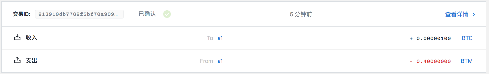

调用币币交易合约实例
==================

- [1 构建解锁合约交易](#1-构建解锁合约交易)
- [2 对消息进行签名](#2-对消息进行签名)
  - [2.1 使用本地 api 签署](#21-使用本地-api-签署)
  - [2.2 使用命令行进行签署](#22-使用命令行进行签署)
- [3 提交解锁交易](#3-提交解锁交易)

## 1 构建解锁合约交易

```
$ swap calltradeoff -h
call tradeoff contract

Usage:
  swap calltradeoff <guid> <contractUTXOID> <assetRequested> <amountRequested> <seller> [URL flags(ip and port)] [flags]

Flags:
  -h, --help          help for calltradeoff
      --ip string     network address (default "127.0.0.1")
      --port string   network port (default "9888")
```

其中：

- guid：用户 guid
- contractUTXOID：合约 UTXO ID
- assetRequested：解锁合约需要的资产 ID
- amountRequested：解锁合约需要的资产数量
- seller：收取合约资产的 program

构建解锁交易：

```
$ swap calltradeoff e18b91ba-91a5-4837-9d41-ce2b76cea81c d7f3e1c0dda851b58ef66ed09c3eaa7f018e62c3f3d23a0ebf9ad856c7f17122 ffffffffffffffffffffffffffffffffffffffffffffffffffffffffffffffff 100 00145b0a81adc5c2d68a9967082a09c96e82d62aa058
build unlocked contract tx: {"guid":"e18b91ba-91a5-4837-9d41-ce2b76cea81c","fee":40000000,"confirmations":1,"inputs":[{"type":"spend_utxo","output_id":"d7f3e1c0dda851b58ef66ed09c3eaa7f018e62c3f3d23a0ebf9ad856c7f17122"},{"type":"spend_wallet","asset":"ffffffffffffffffffffffffffffffffffffffffffffffffffffffffffffffff","amount":100}],"outputs":[{"type":"control_program","amount":100,"asset":"ffffffffffffffffffffffffffffffffffffffffffffffffffffffffffffffff","control_program":"00145b0a81adc5c2d68a9967082a09c96e82d62aa058"}]}
build call tradeoff tx result: {
	"raw_transaction": "0701000201c00101bd012ad9755cdea3128a8b64b7d7e0007a84696306a08c4def95828995925a20d2c3bae7e17bb8f5d0cfbfd87a92f3204da082d388d4c9b10e8dcd36b3d0a18ceb3a6400017920eec15ce68d46569f92ecebd7769101b22e34109892cc7ddfd54dc772f850c2431600145b0a81adc5c2d68a9967082a09c96e82d62aa058016420ffffffffffffffffffffffffffffffffffffffffffffffffffffffffffffffff741a547a6413000000007b7b51547ac1631a000000547a547aae7cac00c001000161015f969355c29dfda6ba79e57859a3fff5af31c9dba9d064c0fcab8ce12c72ac14f1ffffffffffffffffffffffffffffffffffffffffffffffffffffffffffffffff8099c4d5990100011600145b0a81adc5c2d68a9967082a09c96e82d62aa058220120eec15ce68d46569f92ecebd7769101b22e34109892cc7ddfd54dc772f850c243030139ffffffffffffffffffffffffffffffffffffffffffffffffffffffffffffffff64011600145b0a81adc5c2d68a9967082a09c96e82d62aa058000139bae7e17bb8f5d0cfbfd87a92f3204da082d388d4c9b10e8dcd36b3d0a18ceb3a64011600145b0a81adc5c2d68a9967082a09c96e82d62aa05800013effffffffffffffffffffffffffffffffffffffffffffffffffffffffffffffff9ce4bac29901011600145b0a81adc5c2d68a9967082a09c96e82d62aa05800",
	"signing_instructions": [
		{
			"derivation_path": null,
			"sign_data": [
				"d9fb3f938deff9435256957450c978c12c0bf92e6f94f7f001d98c365c9ea70e"
			]
		},
		{
			"derivation_path": [
				"2c000000",
				"99000000",
				"01000000",
				"00000000",
				"01000000"
			],
			"sign_data": [
				"502adec850d713982e2f7e87a48b7a6a9a0ef872e68d559463e0a7792fbc90a9"
			],
			"pubkey": "eec15ce68d46569f92ecebd7769101b22e34109892cc7ddfd54dc772f850c243"
		}
	],
	"fee": 40000000
}
```

其中：

- e18b91ba-91a5-4837-9d41-ce2b76cea81c：用户 guid
- d7f3e1c0dda851b58ef66ed09c3eaa7f018e62c3f3d23a0ebf9ad856c7f17122：合约 UTXO ID
- ffffffffffffffffffffffffffffffffffffffffffffffffffffffffffffffff：合约请求的资产，即发送给 seller 的资产
- 100：合约请求的资产数量，即发送给 seller 的资产数量
- 00145b0a81adc5c2d68a9967082a09c96e82d62aa058：seller 的 program

对 raw_transaction 进行解析：

```
$ bytomcli decode-raw-transaction 0701000201c00101bd012ad9755cdea3128a8b64b7d7e0007a84696306a08c4def95828995925a20d2c3bae7e17bb8f5d0cfbfd87a92f3204da082d388d4c9b10e8dcd36b3d0a18ceb3a6400017920eec15ce68d46569f92ecebd7769101b22e34109892cc7ddfd54dc772f850c2431600145b0a81adc5c2d68a9967082a09c96e82d62aa058016420ffffffffffffffffffffffffffffffffffffffffffffffffffffffffffffffff741a547a6413000000007b7b51547ac1631a000000547a547aae7cac00c001000161015f969355c29dfda6ba79e57859a3fff5af31c9dba9d064c0fcab8ce12c72ac14f1ffffffffffffffffffffffffffffffffffffffffffffffffffffffffffffffff8099c4d5990100011600145b0a81adc5c2d68a9967082a09c96e82d62aa058220120eec15ce68d46569f92ecebd7769101b22e34109892cc7ddfd54dc772f850c243030139ffffffffffffffffffffffffffffffffffffffffffffffffffffffffffffffff64011600145b0a81adc5c2d68a9967082a09c96e82d62aa058000139bae7e17bb8f5d0cfbfd87a92f3204da082d388d4c9b10e8dcd36b3d0a18ceb3a64011600145b0a81adc5c2d68a9967082a09c96e82d62aa05800013effffffffffffffffffffffffffffffffffffffffffffffffffffffffffffffff9ce4bac29901011600145b0a81adc5c2d68a9967082a09c96e82d62aa05800
```

```json
{
  "fee": 40000000,
  "inputs": [
    {
      "amount": 100,
      "asset_definition": {},
      "asset_id": "bae7e17bb8f5d0cfbfd87a92f3204da082d388d4c9b10e8dcd36b3d0a18ceb3a",
      "control_program": "20eec15ce68d46569f92ecebd7769101b22e34109892cc7ddfd54dc772f850c2431600145b0a81adc5c2d68a9967082a09c96e82d62aa058016420ffffffffffffffffffffffffffffffffffffffffffffffffffffffffffffffff741a547a6413000000007b7b51547ac1631a000000547a547aae7cac00c0",
      "input_id": "ca35e376376b47bab172c10dda45eaf00e624536065188c4380c68b3ee9d3d60",
      "sign_data": "d9fb3f938deff9435256957450c978c12c0bf92e6f94f7f001d98c365c9ea70e",
      "spent_output_id": "d7f3e1c0dda851b58ef66ed09c3eaa7f018e62c3f3d23a0ebf9ad856c7f17122",
      "type": "spend",
      "witness_arguments": null
    },
    {
      "address": "sm1qtv9grtw9cttg4xt8pq4qnjtwsttz4gzcp02cr3",
      "amount": 41250000000,
      "asset_definition": {},
      "asset_id": "ffffffffffffffffffffffffffffffffffffffffffffffffffffffffffffffff",
      "control_program": "00145b0a81adc5c2d68a9967082a09c96e82d62aa058",
      "input_id": "cee291d0a5504beefe7f81ab4b2b39857a545570f4f50c90fb7614492dfce2e5",
      "sign_data": "502adec850d713982e2f7e87a48b7a6a9a0ef872e68d559463e0a7792fbc90a9",
      "spent_output_id": "8c06cf07f2df3b2a3de9da9c47e09f4ccfc0fbcf6d5d10f44b9e4112410c9666",
      "type": "spend",
      "witness_arguments": [
        "eec15ce68d46569f92ecebd7769101b22e34109892cc7ddfd54dc772f850c243"
      ]
    }
  ],
  "outputs": [
    {
      "address": "sm1qtv9grtw9cttg4xt8pq4qnjtwsttz4gzcp02cr3",
      "amount": 100,
      "asset_definition": {},
      "asset_id": "ffffffffffffffffffffffffffffffffffffffffffffffffffffffffffffffff",
      "control_program": "00145b0a81adc5c2d68a9967082a09c96e82d62aa058",
      "id": "6fff2718daa498029961eca76221d0f7f42a52ff42d58740793c9d67195edd75",
      "position": 0,
      "type": "control"
    },
    {
      "address": "sm1qtv9grtw9cttg4xt8pq4qnjtwsttz4gzcp02cr3",
      "amount": 100,
      "asset_definition": {},
      "asset_id": "bae7e17bb8f5d0cfbfd87a92f3204da082d388d4c9b10e8dcd36b3d0a18ceb3a",
      "control_program": "00145b0a81adc5c2d68a9967082a09c96e82d62aa058",
      "id": "4925b2f17b7c2a781db211216ee05ccbd6257f6d8b8dc57abdfcc9ec3f253f7b",
      "position": 1,
      "type": "control"
    },
    {
      "address": "sm1qtv9grtw9cttg4xt8pq4qnjtwsttz4gzcp02cr3",
      "amount": 41209999900,
      "asset_definition": {},
      "asset_id": "ffffffffffffffffffffffffffffffffffffffffffffffffffffffffffffffff",
      "control_program": "00145b0a81adc5c2d68a9967082a09c96e82d62aa058",
      "id": "7e5e12c3bb208cf0c6a7f5b8d049bb260727f583dcf2fbf4a89cf1e074018075",
      "position": 2,
      "type": "control"
    }
  ],
  "size": 521,
  "time_range": 0,
  "tx_id": "813910db7768f5bf70a9092ea43b836df3b5b14c9a6b03e9a3e7dd8982a8eb9a",
  "version": 1
}
```

## 2 对消息进行签名

需要签名的 sign_data 为：

- d9fb3f938deff9435256957450c978c12c0bf92e6f94f7f001d98c365c9ea70e
- 502adec850d713982e2f7e87a48b7a6a9a0ef872e68d559463e0a7792fbc90a9

用户调用币币交易合约不需要对 UTXO ID 的交易输入数据进行签名，因为合约解锁条件不需要签名，只需要向合约中规定的 seller 转账指定的资产即可。因此只需要对第二个交易输入的数据进行签名即可。

对数据进行签署的方法有两种，可任取其一。

### 2.1 使用本地 api 签署

调用 127.0.0.1:9888/sign-message api 对 502adec850d713982e2f7e87a48b7a6a9a0ef872e68d559463e0a7792fbc90a9 进行签名：

post:

```json
{
    "address": "sm1qtv9grtw9cttg4xt8pq4qnjtwsttz4gzcp02cr3",
    "message": "502adec850d713982e2f7e87a48b7a6a9a0ef872e68d559463e0a7792fbc90a9",
    "password": "12345"
}
```

response:

```json
{
    "status": "success",
    "data": {
        "signature": "b2cd0368a20c06f5a59f6ff4c8fb5264cc0ea5b3ec78e89522895f0c7cca965561056fcbacea9a4ab488690c334c3d0b3116ccd40052370d7f889ec28d345b04",
        "derived_xpub": "eec15ce68d46569f92ecebd7769101b22e34109892cc7ddfd54dc772f850c243013095e747f609c86703ee7c0281b2182dfaca66d60ea58814d7929e6b6968a5"
    }
}
```

### 2.2 使用命令行进行签署

```
$ swap sign -h
sign message

Usage:
  swap sign <xprv> <message> [flags]

Flags:
  -h, --help   help for sign
```

账户 a1 对应的私钥为：682d87647c76edafb0c0bdb8b9a87e84f79627c86a4d7620c89a9ef7551ecf47013095e747f609c86703ee7c0281b2182dfaca66d60ea58814d7929e6b6968a5

```
$ swap sign 682d87647c76edafb0c0bdb8b9a87e84f79627c86a4d7620c89a9ef7551ecf47013095e747f609c86703ee7c0281b2182dfaca66d60ea58814d7929e6b6968a5 502adec850d713982e2f7e87a48b7a6a9a0ef872e68d559463e0a7792fbc90a9

sign result:
xprv: 682d87647c76edafb0c0bdb8b9a87e84f79627c86a4d7620c89a9ef7551ecf47013095e747f609c86703ee7c0281b2182dfaca66d60ea58814d7929e6b6968a5
message: 502adec850d713982e2f7e87a48b7a6a9a0ef872e68d559463e0a7792fbc90a9
signature: b2cd0368a20c06f5a59f6ff4c8fb5264cc0ea5b3ec78e89522895f0c7cca965561056fcbacea9a4ab488690c334c3d0b3116ccd40052370d7f889ec28d345b04
```

## 3 提交解锁交易

```
$ swap submit -h
submit a payment

Usage:
  swap submit <action> <guid> <rawTx> [spend parameters] [URL flags(ip and port)] [flags]

Flags:
  -h, --help          help for submit
      --ip string     network address (default "127.0.0.1")
      --port string   network port (default "3000")
```

```
$ swap submit calltradeoff e18b91ba-91a5-4837-9d41-ce2b76cea81c 0701000201c00101bd012ad9755cdea3128a8b64b7d7e0007a84696306a08c4def95828995925a20d2c3bae7e17bb8f5d0cfbfd87a92f3204da082d388d4c9b10e8dcd36b3d0a18ceb3a6400017920eec15ce68d46569f92ecebd7769101b22e34109892cc7ddfd54dc772f850c2431600145b0a81adc5c2d68a9967082a09c96e82d62aa058016420ffffffffffffffffffffffffffffffffffffffffffffffffffffffffffffffff741a547a6413000000007b7b51547ac1631a000000547a547aae7cac00c001000161015f969355c29dfda6ba79e57859a3fff5af31c9dba9d064c0fcab8ce12c72ac14f1ffffffffffffffffffffffffffffffffffffffffffffffffffffffffffffffff8099c4d5990100011600145b0a81adc5c2d68a9967082a09c96e82d62aa058220120eec15ce68d46569f92ecebd7769101b22e34109892cc7ddfd54dc772f850c243030139ffffffffffffffffffffffffffffffffffffffffffffffffffffffffffffffff64011600145b0a81adc5c2d68a9967082a09c96e82d62aa058000139bae7e17bb8f5d0cfbfd87a92f3204da082d388d4c9b10e8dcd36b3d0a18ceb3a64011600145b0a81adc5c2d68a9967082a09c96e82d62aa05800013effffffffffffffffffffffffffffffffffffffffffffffffffffffffffffffff9ce4bac29901011600145b0a81adc5c2d68a9967082a09c96e82d62aa05800 b2cd0368a20c06f5a59f6ff4c8fb5264cc0ea5b3ec78e89522895f0c7cca965561056fcbacea9a4ab488690c334c3d0b3116ccd40052370d7f889ec28d345b04

submitPayment: {
	"guid": "e18b91ba-91a5-4837-9d41-ce2b76cea81c",
	"raw_transaction": "0701000201c00101bd012ad9755cdea3128a8b64b7d7e0007a84696306a08c4def95828995925a20d2c3bae7e17bb8f5d0cfbfd87a92f3204da082d388d4c9b10e8dcd36b3d0a18ceb3a6400017920eec15ce68d46569f92ecebd7769101b22e34109892cc7ddfd54dc772f850c2431600145b0a81adc5c2d68a9967082a09c96e82d62aa058016420ffffffffffffffffffffffffffffffffffffffffffffffffffffffffffffffff741a547a6413000000007b7b51547ac1631a000000547a547aae7cac00c001000161015f969355c29dfda6ba79e57859a3fff5af31c9dba9d064c0fcab8ce12c72ac14f1ffffffffffffffffffffffffffffffffffffffffffffffffffffffffffffffff8099c4d5990100011600145b0a81adc5c2d68a9967082a09c96e82d62aa058220120eec15ce68d46569f92ecebd7769101b22e34109892cc7ddfd54dc772f850c243030139ffffffffffffffffffffffffffffffffffffffffffffffffffffffffffffffff64011600145b0a81adc5c2d68a9967082a09c96e82d62aa058000139bae7e17bb8f5d0cfbfd87a92f3204da082d388d4c9b10e8dcd36b3d0a18ceb3a64011600145b0a81adc5c2d68a9967082a09c96e82d62aa05800013effffffffffffffffffffffffffffffffffffffffffffffffffffffffffffffff9ce4bac29901011600145b0a81adc5c2d68a9967082a09c96e82d62aa05800",
	"signatures": [
		[
			""
		],
		[
			"b2cd0368a20c06f5a59f6ff4c8fb5264cc0ea5b3ec78e89522895f0c7cca965561056fcbacea9a4ab488690c334c3d0b3116ccd40052370d7f889ec28d345b04"
		]
	],
	"memo": ""
}
submit calltradeoff tx result: 813910db7768f5bf70a9092ea43b836df3b5b14c9a6b03e9a3e7dd8982a8eb9a
```

其中：

- callhtlc：表示提交的交易类型是调用 HTLC
- e18b91ba-91a5-4837-9d41-ce2b76cea81c：用户的 guid
- 0701000201c00101bd012ad9755cdea3128a8b64b7d7e0007a84696306a08c4def95828995925a20d2c3bae7e17bb8f5d0cfbfd87a92f3204da082d388d4c9b10e8dcd36b3d0a18ceb3a6400017920eec15ce68d46569f92ecebd7769101b22e34109892cc7ddfd54dc772f850c2431600145b0a81adc5c2d68a9967082a09c96e82d62aa058016420ffffffffffffffffffffffffffffffffffffffffffffffffffffffffffffffff741a547a6413000000007b7b51547ac1631a000000547a547aae7cac00c001000161015f969355c29dfda6ba79e57859a3fff5af31c9dba9d064c0fcab8ce12c72ac14f1ffffffffffffffffffffffffffffffffffffffffffffffffffffffffffffffff8099c4d5990100011600145b0a81adc5c2d68a9967082a09c96e82d62aa058220120eec15ce68d46569f92ecebd7769101b22e34109892cc7ddfd54dc772f850c243030139ffffffffffffffffffffffffffffffffffffffffffffffffffffffffffffffff64011600145b0a81adc5c2d68a9967082a09c96e82d62aa058000139bae7e17bb8f5d0cfbfd87a92f3204da082d388d4c9b10e8dcd36b3d0a18ceb3a64011600145b0a81adc5c2d68a9967082a09c96e82d62aa05800013effffffffffffffffffffffffffffffffffffffffffffffffffffffffffffffff9ce4bac29901011600145b0a81adc5c2d68a9967082a09c96e82d62aa05800：构建的原始交易数据。
- b2cd0368a20c06f5a59f6ff4c8fb5264cc0ea5b3ec78e89522895f0c7cca965561056fcbacea9a4ab488690c334c3d0b3116ccd40052370d7f889ec28d345b04：交易手续费所消耗的 UTXO 所对应的签名值



合约锁定的资产返回到 seller，即账户 a1。
