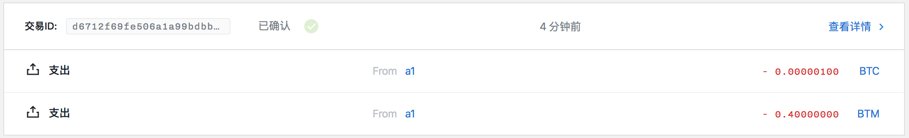

部署 HTLC 实例
==============

- [1 合约实例化](#1-合约实例化)
- [2 创建部署 HTLC 的交易](#2-创建部署-htlc-的交易)
- [3 对数据进行签名](#3-对数据进行签名)
  - [3.1 使用本地 api 签署](#31-使用本地-api-签署)
  - [3.2 使用命令行进行签署](#32-使用命令行进行签署)
- [4 发送交易](#4-发送交易)

## 1 合约实例化

首先安装 shuttle：

```
$ cd /Users/zcc/GoWorkspace/src/github.com/shuttle/
$ make install
$ swap -h
swap is a commond line client for bytom contract

Usage:
  swap [flags]
  swap [command]

Available Commands:
  callhtlc       call HTLC contract
  calltradeoff   call tradeoff contract
  cancelhtlc     cancel HTLC contract
  canceltradeoff cancel tradeoff contract
  deployhtlc     deploy HTLC contract
  deploytradeoff deploy tradeoff contract
  equity         equity commandline compiler
  help           Help about any command
  sign           sign message
  submit         submit a payment

Flags:
  -h, --help   help for swap

Use "swap [command] --help" for more information about a command.
```

首先 HTC 合约如下：

```
contract HTLC(
  sender: PublicKey,
  recipient: PublicKey,
  blockHeight: Integer,
  hash: Hash
) locks valueAmount of valueAsset {
  clause complete(preimage: String, sig: Signature) {
    verify sha256(preimage) == hash
    verify checkTxSig(recipient, sig)
    unlock valueAmount of valueAsset
  }
  clause cancel(sig: Signature) {
    verify above(blockHeight)
    verify checkTxSig(sender, sig)
    unlock valueAmount of valueAsset
  }
}
```

对合约进行实例化：

```
$ swap equity contracts/htlc --instance eec15ce68d46569f92ecebd7769101b22e34109892cc7ddfd54dc772f850c243 6ea28f3f1389efd6a731de070fb38ab69dc93dae6c73b6524bac901b662f601d 100 2cf24dba5fb0a30e26e83b2ac5b9e29e1b161e5c1fa7425e73043362938b9824
======= HTLC =======
Instantiated program:
202cf24dba5fb0a30e26e83b2ac5b9e29e1b161e5c1fa7425e73043362938b98240164206ea28f3f1389efd6a731de070fb38ab69dc93dae6c73b6524bac901b662f601d20eec15ce68d46569f92ecebd7769101b22e34109892cc7ddfd54dc772f850c2437422547a6418000000557aa8547a88537a7bae7cac63220000007bcd9f69537a7cae7cac00c0
```

其中：

- contracts/htlc 表示 HTLC 合约所在目录
- eec15ce68d46569f92ecebd7769101b22e34109892cc7ddfd54dc772f850c243 ：发送者公钥，是账户 a1 的第一个非找零地址所对应公钥，对应地址为 sm1qtv9grtw9cttg4xt8pq4qnjtwsttz4gzcp02cr3
- 6ea28f3f1389efd6a731de070fb38ab69dc93dae6c73b6524bac901b662f601d ：接受者公钥，是账户 a2 的第一个非找零地址所对应公钥，对应地址为 sm1qpl0wzzz585c9xzqfwqvuaddwc0dxpmrxzp56s5
- 100 ：限定合约锁定的高度
- 2cf24dba5fb0a30e26e83b2ac5b9e29e1b161e5c1fa7425e73043362938b9824 ：hello 的哈希值

202cf24dba5fb0a30e26e83b2ac5b9e29e1b161e5c1fa7425e73043362938b98240164206ea28f3f1389efd6a731de070fb38ab69dc93dae6c73b6524bac901b662f601d20eec15ce68d46569f92ecebd7769101b22e34109892cc7ddfd54dc772f850c2437422547a6418000000557aa8547a88537a7bae7cac63220000007bcd9f69537a7cae7cac00c0 就是 HTLC 实例化结果。

## 2 创建部署 HTLC 的交易

建立合约交易：

```
$ swap deployhtlc -h
deploy HTLC contract

Usage:
  swap deployhtlc <guid> <lockedAsset> <lockedAmount> <contractProgram> [URL flags(ip and port)] [flags]

Flags:
  -h, --help          help for deployhtlc
      --ip string     network address (default "127.0.0.1")
      --port string   network port (default "3000")
```

```
$ swap deployhtlc e18b91ba-91a5-4837-9d41-ce2b76cea81c bae7e17bb8f5d0cfbfd87a92f3204da082d388d4c9b10e8dcd36b3d0a18ceb3a 100 202cf24dba5fb0a30e26e83b2ac5b9e29e1b161e5c1fa7425e73043362938b98240164206ea28f3f1389efd6a731de070fb38ab69dc93dae6c73b6524bac901b662f601d20eec15ce68d46569f92ecebd7769101b22e34109892cc7ddfd54dc772f850c2437422547a6418000000557aa8547a88537a7bae7cac63220000007bcd9f69537a7cae7cac00c0
buildTx: {"guid":"e18b91ba-91a5-4837-9d41-ce2b76cea81c","fee":40000000,"confirmations":1,"inputs":[{"type":"spend_wallet","asset":"bae7e17bb8f5d0cfbfd87a92f3204da082d388d4c9b10e8dcd36b3d0a18ceb3a","amount":100}],"outputs":[{"type":"control_program","amount":100,"asset":"bae7e17bb8f5d0cfbfd87a92f3204da082d388d4c9b10e8dcd36b3d0a18ceb3a","control_program":"202cf24dba5fb0a30e26e83b2ac5b9e29e1b161e5c1fa7425e73043362938b98240164206ea28f3f1389efd6a731de070fb38ab69dc93dae6c73b6524bac901b662f601d20eec15ce68d46569f92ecebd7769101b22e34109892cc7ddfd54dc772f850c2437422547a6418000000557aa8547a88537a7bae7cac63220000007bcd9f69537a7cae7cac00c0"}]}
build tx result: {
	"raw_transaction": "07010002015c015ac5d7e53a92ee95425199c6074a338e294aa57b779bbd2af3359c4aae93c0c0fabae7e17bb8f5d0cfbfd87a92f3204da082d388d4c9b10e8dcd36b3d0a18ceb3a6401011600145b0a81adc5c2d68a9967082a09c96e82d62aa058220120eec15ce68d46569f92ecebd7769101b22e34109892cc7ddfd54dc772f850c2430161015f83b70c24c9c41b4ab153fde3ae3f39e74fdee2f6b0558d5537b8375c22088170ffffffffffffffffffffffffffffffffffffffffffffffffffffffffffffffff8099c4d5990100011600145b0a81adc5c2d68a9967082a09c96e82d62aa058220120eec15ce68d46569f92ecebd7769101b22e34109892cc7ddfd54dc772f850c2430201af01bae7e17bb8f5d0cfbfd87a92f3204da082d388d4c9b10e8dcd36b3d0a18ceb3a64018b01202cf24dba5fb0a30e26e83b2ac5b9e29e1b161e5c1fa7425e73043362938b98240164206ea28f3f1389efd6a731de070fb38ab69dc93dae6c73b6524bac901b662f601d20eec15ce68d46569f92ecebd7769101b22e34109892cc7ddfd54dc772f850c2437422547a6418000000557aa8547a88537a7bae7cac63220000007bcd9f69537a7cae7cac00c000013effffffffffffffffffffffffffffffffffffffffffffffffffffffffffffffff80e5bac29901011600145b0a81adc5c2d68a9967082a09c96e82d62aa05800",
	"signing_instructions": [
		{
			"derivation_path": [
				"2c000000",
				"99000000",
				"01000000",
				"00000000",
				"01000000"
			],
			"sign_data": [
				"27c42b40a7a35a6d489fb2e41bde15bdb4b4c276045bd0628525b88c2abbc4c0"
			],
			"pubkey": "eec15ce68d46569f92ecebd7769101b22e34109892cc7ddfd54dc772f850c243"
		},
		{
			"derivation_path": [
				"2c000000",
				"99000000",
				"01000000",
				"00000000",
				"01000000"
			],
			"sign_data": [
				"70621fc64f83b5ae89ea2e4a24a1f5ce096374a44e5add98b0bfb954a4d45cf4"
			],
			"pubkey": "eec15ce68d46569f92ecebd7769101b22e34109892cc7ddfd54dc772f850c243"
		}
	],
	"fee": 40000000
}
```

其中：

- e18b91ba-91a5-4837-9d41-ce2b76cea81c：用户的 guid
- bae7e17bb8f5d0cfbfd87a92f3204da082d388d4c9b10e8dcd36b3d0a18ceb3a：锁定的资产 ID
- 202cf24dba5fb0a30e26e83b2ac5b9e29e1b161e5c1fa7425e73043362938b98240164206ea28f3f1389efd6a731de070fb38ab69dc93dae6c73b6524bac901b662f601d20eec15ce68d46569f92ecebd7769101b22e34109892cc7ddfd54dc772f850c2437422547a6418000000557aa8547a88537a7bae7cac63220000007bcd9f69537a7cae7cac00c0：合约实例化之后的结果
- 100：锁定的资产数量

对 raw_transaction 进行解码：

```
$ bytomcli decode-raw-transaction 07010002015c015ac5d7e53a92ee95425199c6074a338e294aa57b779bbd2af3359c4aae93c0c0fabae7e17bb8f5d0cfbfd87a92f3204da082d388d4c9b10e8dcd36b3d0a18ceb3a6401011600145b0a81adc5c2d68a9967082a09c96e82d62aa058220120eec15ce68d46569f92ecebd7769101b22e34109892cc7ddfd54dc772f850c2430161015f83b70c24c9c41b4ab153fde3ae3f39e74fdee2f6b0558d5537b8375c22088170ffffffffffffffffffffffffffffffffffffffffffffffffffffffffffffffff8099c4d5990100011600145b0a81adc5c2d68a9967082a09c96e82d62aa058220120eec15ce68d46569f92ecebd7769101b22e34109892cc7ddfd54dc772f850c2430201af01bae7e17bb8f5d0cfbfd87a92f3204da082d388d4c9b10e8dcd36b3d0a18ceb3a64018b01202cf24dba5fb0a30e26e83b2ac5b9e29e1b161e5c1fa7425e73043362938b98240164206ea28f3f1389efd6a731de070fb38ab69dc93dae6c73b6524bac901b662f601d20eec15ce68d46569f92ecebd7769101b22e34109892cc7ddfd54dc772f850c2437422547a6418000000557aa8547a88537a7bae7cac63220000007bcd9f69537a7cae7cac00c000013effffffffffffffffffffffffffffffffffffffffffffffffffffffffffffffff80e5bac29901011600145b0a81adc5c2d68a9967082a09c96e82d62aa05800
```

```json
{
  "fee": 40000000,
  "inputs": [
    {
      "address": "sm1qtv9grtw9cttg4xt8pq4qnjtwsttz4gzcp02cr3",
      "amount": 100,
      "asset_definition": {},
      "asset_id": "bae7e17bb8f5d0cfbfd87a92f3204da082d388d4c9b10e8dcd36b3d0a18ceb3a",
      "control_program": "00145b0a81adc5c2d68a9967082a09c96e82d62aa058",
      "input_id": "b7053de358f46a0aa67486508e856789e9824ebcd557b3e037dbf1f77490a974",
      "sign_data": "27c42b40a7a35a6d489fb2e41bde15bdb4b4c276045bd0628525b88c2abbc4c0",
      "spent_output_id": "8c942a06cfd33600cd36f566ba6cfc7cad27540407c1c0c979ef042a89313be1",
      "type": "spend",
      "witness_arguments": [
        "eec15ce68d46569f92ecebd7769101b22e34109892cc7ddfd54dc772f850c243"
      ]
    },
    {
      "address": "sm1qtv9grtw9cttg4xt8pq4qnjtwsttz4gzcp02cr3",
      "amount": 41250000000,
      "asset_definition": {},
      "asset_id": "ffffffffffffffffffffffffffffffffffffffffffffffffffffffffffffffff",
      "control_program": "00145b0a81adc5c2d68a9967082a09c96e82d62aa058",
      "input_id": "838583c20bd172d328fea9538b499a605d5e3379230c48a1660a780ed478f5e7",
      "sign_data": "70621fc64f83b5ae89ea2e4a24a1f5ce096374a44e5add98b0bfb954a4d45cf4",
      "spent_output_id": "5f0e06470fc054b5ab40ce1990a5ee8c3a84d8b888eb903044859b2f432b53c9",
      "type": "spend",
      "witness_arguments": [
        "eec15ce68d46569f92ecebd7769101b22e34109892cc7ddfd54dc772f850c243"
      ]
    }
  ],
  "outputs": [
    {
      "amount": 100,
      "asset_definition": {},
      "asset_id": "bae7e17bb8f5d0cfbfd87a92f3204da082d388d4c9b10e8dcd36b3d0a18ceb3a",
      "control_program": "202cf24dba5fb0a30e26e83b2ac5b9e29e1b161e5c1fa7425e73043362938b98240164206ea28f3f1389efd6a731de070fb38ab69dc93dae6c73b6524bac901b662f601d20eec15ce68d46569f92ecebd7769101b22e34109892cc7ddfd54dc772f850c2437422547a6418000000557aa8547a88537a7bae7cac63220000007bcd9f69537a7cae7cac00c0",
      "id": "dde4198542ec1904dbfa026c16987e4181c2dd7ceb826900a25ec119613c36d1",
      "position": 0,
      "type": "control"
    },
    {
      "address": "sm1qtv9grtw9cttg4xt8pq4qnjtwsttz4gzcp02cr3",
      "amount": 41210000000,
      "asset_definition": {},
      "asset_id": "ffffffffffffffffffffffffffffffffffffffffffffffffffffffffffffffff",
      "control_program": "00145b0a81adc5c2d68a9967082a09c96e82d62aa058",
      "id": "c6d3d19c3c7d725ed12087a59cf2c16c3098c16ac997677967bcc4dfe701ee82",
      "position": 1,
      "type": "control"
    }
  ],
  "size": 512,
  "time_range": 0,
  "tx_id": "d6712f69fe506a1a99bdbb599bc6031e1fc4a75ad0c1034b21fad3c70316c203",
  "version": 1
}
```

## 3 对数据进行签名

交易有两个交易输入，所以对交易进行签名的时候也有两个 sign_data 需要签署。签署 sign_data 有两个方法，第一种就是利用 bytom 的本地 api 签署，第二种是知道所引用的 utxo_id 的地址所对应的 xprv，调用命令行进行签署。两种方法效果相同。

本例中，两个交易输入所引用的 utxo_id 所对应的地址均为 sm1qtv9grtw9cttg4xt8pq4qnjtwsttz4gzcp02cr3，其 xprv 为：682d87647c76edafb0c0bdb8b9a87e84f79627c86a4d7620c89a9ef7551ecf47013095e747f609c86703ee7c0281b2182dfaca66d60ea58814d7929e6b6968a5。需要签名的 sign_data 为：

- 27c42b40a7a35a6d489fb2e41bde15bdb4b4c276045bd0628525b88c2abbc4c0
- 70621fc64f83b5ae89ea2e4a24a1f5ce096374a44e5add98b0bfb954a4d45cf4

### 3.1 使用本地 api 签署

调用 127.0.0.1:9888/sign-message api 对 27c42b40a7a35a6d489fb2e41bde15bdb4b4c276045bd0628525b88c2abbc4c0 进行签名：

post:

```json
{
    "address": "sm1qtv9grtw9cttg4xt8pq4qnjtwsttz4gzcp02cr3",
    "message": "27c42b40a7a35a6d489fb2e41bde15bdb4b4c276045bd0628525b88c2abbc4c0",
    "password": "12345"
}
```

response:

```json
{
    "status": "success",
    "data": {
        "signature": "75ca5b6cf7ba40c7a51f20e1fd03686666e09cf58d0d2978ab6072d8057cbbd3072eabbdefe96eefcbb0c8ec654239b82fa5efcbe24e8704c7d06efd79c40d0a",
        "derived_xpub": "eec15ce68d46569f92ecebd7769101b22e34109892cc7ddfd54dc772f850c243013095e747f609c86703ee7c0281b2182dfaca66d60ea58814d7929e6b6968a5"
    }
}
```

调用 127.0.0.1:9888/sign-message api 对 70621fc64f83b5ae89ea2e4a24a1f5ce096374a44e5add98b0bfb954a4d45cf4 进行签名：

post:

```json
{
    "address": "sm1qtv9grtw9cttg4xt8pq4qnjtwsttz4gzcp02cr3",
    "message": "70621fc64f83b5ae89ea2e4a24a1f5ce096374a44e5add98b0bfb954a4d45cf4",
    "password": "12345"
}
```

response:

```json
{
    "status": "success",
    "data": {
        "signature": "44e3f103f45c24b479a2fb61147e09039290dcd8c644091683d9d3ff8dab7e34af282a9f6d441e0599f076120f6e30ae0bd476550287386a18cacc06fe429a09",
        "derived_xpub": "eec15ce68d46569f92ecebd7769101b22e34109892cc7ddfd54dc772f850c243013095e747f609c86703ee7c0281b2182dfaca66d60ea58814d7929e6b6968a5"
    }
}
```

### 3.2 使用命令行进行签署

```
$ swap sign -h
sign message

Usage:
  swap sign [xprv] [message] [flags]

Flags:
  -h, --help   help for sign
```

```
$ swap sign 682d87647c76edafb0c0bdb8b9a87e84f79627c86a4d7620c89a9ef7551ecf47013095e747f609c86703ee7c0281b2182dfaca66d60ea58814d7929e6b6968a5 27c42b40a7a35a6d489fb2e41bde15bdb4b4c276045bd0628525b88c2abbc4c0

sign result:
xprv: 682d87647c76edafb0c0bdb8b9a87e84f79627c86a4d7620c89a9ef7551ecf47013095e747f609c86703ee7c0281b2182dfaca66d60ea58814d7929e6b6968a5
message: 27c42b40a7a35a6d489fb2e41bde15bdb4b4c276045bd0628525b88c2abbc4c0
signature: 75ca5b6cf7ba40c7a51f20e1fd03686666e09cf58d0d2978ab6072d8057cbbd3072eabbdefe96eefcbb0c8ec654239b82fa5efcbe24e8704c7d06efd79c40d0a
```

```
$ swap sign 682d87647c76edafb0c0bdb8b9a87e84f79627c86a4d7620c89a9ef7551ecf47013095e747f609c86703ee7c0281b2182dfaca66d60ea58814d7929e6b6968a5 70621fc64f83b5ae89ea2e4a24a1f5ce096374a44e5add98b0bfb954a4d45cf4

sign result:
xprv: 682d87647c76edafb0c0bdb8b9a87e84f79627c86a4d7620c89a9ef7551ecf47013095e747f609c86703ee7c0281b2182dfaca66d60ea58814d7929e6b6968a5
message: 70621fc64f83b5ae89ea2e4a24a1f5ce096374a44e5add98b0bfb954a4d45cf4
signature: 44e3f103f45c24b479a2fb61147e09039290dcd8c644091683d9d3ff8dab7e34af282a9f6d441e0599f076120f6e30ae0bd476550287386a18cacc06fe429a09
```

## 4 发送交易

```
$ swap submit -h
submit a payment

Usage:
  swap submit <action> <guid> <rawTx> [spend parameters] [URL flags(ip and port)] [flags]

Flags:
  -h, --help          help for submit
      --ip string     network address (default "127.0.0.1")
      --port string   network port (default "3000")
```

```
$ swap submit deployhtlc e18b91ba-91a5-4837-9d41-ce2b76cea81c 07010002015c015ac5d7e53a92ee95425199c6074a338e294aa57b779bbd2af3359c4aae93c0c0fabae7e17bb8f5d0cfbfd87a92f3204da082d388d4c9b10e8dcd36b3d0a18ceb3a6401011600145b0a81adc5c2d68a9967082a09c96e82d62aa058220120eec15ce68d46569f92ecebd7769101b22e34109892cc7ddfd54dc772f850c2430161015f83b70c24c9c41b4ab153fde3ae3f39e74fdee2f6b0558d5537b8375c22088170ffffffffffffffffffffffffffffffffffffffffffffffffffffffffffffffff8099c4d5990100011600145b0a81adc5c2d68a9967082a09c96e82d62aa058220120eec15ce68d46569f92ecebd7769101b22e34109892cc7ddfd54dc772f850c2430201af01bae7e17bb8f5d0cfbfd87a92f3204da082d388d4c9b10e8dcd36b3d0a18ceb3a64018b01202cf24dba5fb0a30e26e83b2ac5b9e29e1b161e5c1fa7425e73043362938b98240164206ea28f3f1389efd6a731de070fb38ab69dc93dae6c73b6524bac901b662f601d20eec15ce68d46569f92ecebd7769101b22e34109892cc7ddfd54dc772f850c2437422547a6418000000557aa8547a88537a7bae7cac63220000007bcd9f69537a7cae7cac00c000013effffffffffffffffffffffffffffffffffffffffffffffffffffffffffffffff80e5bac29901011600145b0a81adc5c2d68a9967082a09c96e82d62aa05800 75ca5b6cf7ba40c7a51f20e1fd03686666e09cf58d0d2978ab6072d8057cbbd3072eabbdefe96eefcbb0c8ec654239b82fa5efcbe24e8704c7d06efd79c40d0a 44e3f103f45c24b479a2fb61147e09039290dcd8c644091683d9d3ff8dab7e34af282a9f6d441e0599f076120f6e30ae0bd476550287386a18cacc06fe429a09
submit deployhtlc tx result: d6712f69fe506a1a99bdbb599bc6031e1fc4a75ad0c1034b21fad3c70316c203
```


