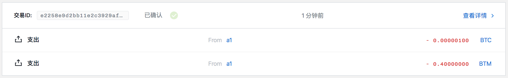
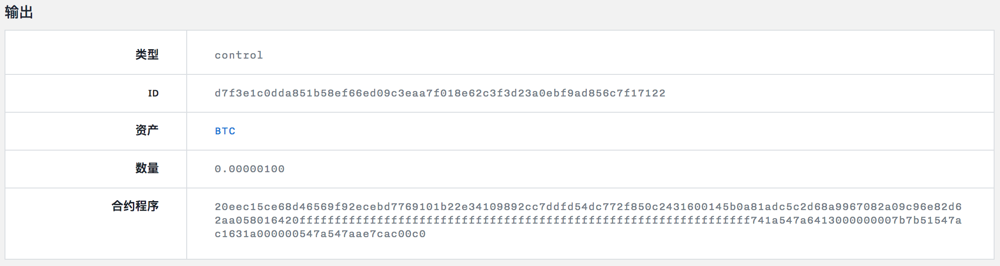

部署币币交易合约实例
=================

- [1 合约实例化](#1-合约实例化)
- [2 创建部署币币交易合约的交易](#2-创建部署币币交易合约的交易)
- [3 对数据进行签名](#3-对数据进行签名)
  - [3.1 使用本地 api 签署](#31-使用本地-api-签署)
  - [3.2 使用命令行进行签署](#32-使用命令行进行签署)
- [4 发送交易](#4-发送交易)

## 1 合约实例化

首先安装 shuttle：

```
$ cd /Users/zcc/GoWorkspace/src/github.com/shuttle/
$ make install
$ swap -h
swap is a commond line client for bytom contract

Usage:
  swap [flags]
  swap [command]

Available Commands:
  callhtlc       call HTLC contract
  calltradeoff   call tradeoff contract
  cancelhtlc     cancel HTLC contract
  canceltradeoff cancel tradeoff contract
  deployhtlc     deploy HTLC contract
  deploytradeoff deploy tradeoff contract
  equity         equity commandline compiler
  help           Help about any command
  sign           sign message
  submit         submit a payment

Flags:
  -h, --help   help for swap

Use "swap [command] --help" for more information about a command.
```

首先币币交易合约如下：

```
contract TradeOffer(assetRequested: Asset,
                    amountRequested: Amount,
                    seller: Program,
                    cancelKey: PublicKey) locks valueAmount of valueAsset {
    clause trade() {
      lock amountRequested of assetRequested with seller
      unlock valueAmount of valueAsset
    }
    clause cancel(sellerSig: Signature) {
      verify checkTxSig(cancelKey, sellerSig)
      unlock valueAmount of valueAsset
    }
  }
```

对合约进行实例化：

```
$ swap equity contracts/tradeoff --instance ffffffffffffffffffffffffffffffffffffffffffffffffffffffffffffffff 100 00145b0a81adc5c2d68a9967082a09c96e82d62aa058 eec15ce68d46569f92ecebd7769101b22e34109892cc7ddfd54dc772f850c243
======= TradeOffer =======
Instantiated program:
20eec15ce68d46569f92ecebd7769101b22e34109892cc7ddfd54dc772f850c2431600145b0a81adc5c2d68a9967082a09c96e82d62aa058016420ffffffffffffffffffffffffffffffffffffffffffffffffffffffffffffffff741a547a6413000000007b7b51547ac1631a000000547a547aae7cac00c0
```

其中：

- contracts/tradeoff：币币交易合约所在目录。
- ffffffffffffffffffffffffffffffffffffffffffffffffffffffffffffffff：请求交易的资产 ID。
- 100：请求交易的资产数量。
- 00145b0a81adc5c2d68a9967082a09c96e82d62aa058：要获取合约锁定的资产，必须向该 00145b0a81adc5c2d68a9967082a09c96e82d62aa058 发送 100 个 ffffffffffffffffffffffffffffffffffffffffffffffffffffffffffffffff。
- eec15ce68d46569f92ecebd7769101b22e34109892cc7ddfd54dc772f850c243：能够取消币币交易合约的私钥所对应的公钥。

20eec15ce68d46569f92ecebd7769101b22e34109892cc7ddfd54dc772f850c2431600145b0a81adc5c2d68a9967082a09c96e82d62aa058016420ffffffffffffffffffffffffffffffffffffffffffffffffffffffffffffffff741a547a6413000000007b7b51547ac1631a000000547a547aae7cac00c0 就是币币交易合约实例化结果。

## 2 创建部署币币交易合约的交易

建立合约交易：

```
$ swap deploytradeoff -h
deploy tradeoff contract

Usage:
  swap deploytradeoff <guid> <lockedAsset> <lockedAmount> <contractProgram> [URL flags(ip and port)] [flags]

Flags:
  -h, --help          help for deploytradeoff
      --ip string     network address (default "127.0.0.1")
      --port string   network port (default "3000")
```

```
$ swap deploytradeoff e18b91ba-91a5-4837-9d41-ce2b76cea81c bae7e17bb8f5d0cfbfd87a92f3204da082d388d4c9b10e8dcd36b3d0a18ceb3a 100 20eec15ce68d46569f92ecebd7769101b22e34109892cc7ddfd54dc772f850c2431600145b0a81adc5c2d68a9967082a09c96e82d62aa058016420ffffffffffffffffffffffffffffffffffffffffffffffffffffffffffffffff741a547a6413000000007b7b51547ac1631a000000547a547aae7cac00c0
buildTx: {"guid":"e18b91ba-91a5-4837-9d41-ce2b76cea81c","fee":40000000,"confirmations":1,"inputs":[{"type":"spend_wallet","asset":"bae7e17bb8f5d0cfbfd87a92f3204da082d388d4c9b10e8dcd36b3d0a18ceb3a","amount":100}],"outputs":[{"type":"control_program","amount":100,"asset":"bae7e17bb8f5d0cfbfd87a92f3204da082d388d4c9b10e8dcd36b3d0a18ceb3a","control_program":"20eec15ce68d46569f92ecebd7769101b22e34109892cc7ddfd54dc772f850c2431600145b0a81adc5c2d68a9967082a09c96e82d62aa058016420ffffffffffffffffffffffffffffffffffffffffffffffffffffffffffffffff741a547a6413000000007b7b51547ac1631a000000547a547aae7cac00c0"}]}
build tx result: {
	"raw_transaction": "07010002015c015ae31a03c6e652944ae4e5351350c2232d7505a9d3f6a46a08a6a23f3f43a4a5b9bae7e17bb8f5d0cfbfd87a92f3204da082d388d4c9b10e8dcd36b3d0a18ceb3a6400011600145b0a81adc5c2d68a9967082a09c96e82d62aa058220120eec15ce68d46569f92ecebd7769101b22e34109892cc7ddfd54dc772f850c2430161015f960e0c76e9e1458490e249a12fc1a8fe9bc557244393637749244a1a812d61d7ffffffffffffffffffffffffffffffffffffffffffffffffffffffffffffffff8099c4d5990100011600145b0a81adc5c2d68a9967082a09c96e82d62aa058220120eec15ce68d46569f92ecebd7769101b22e34109892cc7ddfd54dc772f850c24302019c01bae7e17bb8f5d0cfbfd87a92f3204da082d388d4c9b10e8dcd36b3d0a18ceb3a64017920eec15ce68d46569f92ecebd7769101b22e34109892cc7ddfd54dc772f850c2431600145b0a81adc5c2d68a9967082a09c96e82d62aa058016420ffffffffffffffffffffffffffffffffffffffffffffffffffffffffffffffff741a547a6413000000007b7b51547ac1631a000000547a547aae7cac00c000013effffffffffffffffffffffffffffffffffffffffffffffffffffffffffffffff80e5bac29901011600145b0a81adc5c2d68a9967082a09c96e82d62aa05800",
	"signing_instructions": [
		{
			"derivation_path": [
				"2c000000",
				"99000000",
				"01000000",
				"00000000",
				"01000000"
			],
			"sign_data": [
				"acd389f670e1b40f03c2970a8e99e8f893993fc7907eaa9ab4ad8561c8419d10"
			],
			"pubkey": "eec15ce68d46569f92ecebd7769101b22e34109892cc7ddfd54dc772f850c243"
		},
		{
			"derivation_path": [
				"2c000000",
				"99000000",
				"01000000",
				"00000000",
				"01000000"
			],
			"sign_data": [
				"94f39de22835cbd375df93bd9b52ec55dc557bfaa143f1939f178d066089c53a"
			],
			"pubkey": "eec15ce68d46569f92ecebd7769101b22e34109892cc7ddfd54dc772f850c243"
		}
	],
	"fee": 40000000
}
```

其中：

- e18b91ba-91a5-4837-9d41-ce2b76cea81c：用户的 guid。
- bae7e17bb8f5d0cfbfd87a92f3204da082d388d4c9b10e8dcd36b3d0a18ceb3a：锁定的资产 ID。
- 100：锁定的资产数量。
- 20eec15ce68d46569f92ecebd7769101b22e34109892cc7ddfd54dc772f850c2431600145b0a81adc5c2d68a9967082a09c96e82d62aa058016420ffffffffffffffffffffffffffffffffffffffffffffffffffffffffffffffff741a547a6413000000007b7b51547ac1631a000000547a547aae7cac00c0：合约实例化之后的结果。

对 raw_transaction 进行解码：

```
$ bytomcli decode-raw-transaction 07010002015c015ae31a03c6e652944ae4e5351350c2232d7505a9d3f6a46a08a6a23f3f43a4a5b9bae7e17bb8f5d0cfbfd87a92f3204da082d388d4c9b10e8dcd36b3d0a18ceb3a6400011600145b0a81adc5c2d68a9967082a09c96e82d62aa058220120eec15ce68d46569f92ecebd7769101b22e34109892cc7ddfd54dc772f850c2430161015f960e0c76e9e1458490e249a12fc1a8fe9bc557244393637749244a1a812d61d7ffffffffffffffffffffffffffffffffffffffffffffffffffffffffffffffff8099c4d5990100011600145b0a81adc5c2d68a9967082a09c96e82d62aa058220120eec15ce68d46569f92ecebd7769101b22e34109892cc7ddfd54dc772f850c24302019c01bae7e17bb8f5d0cfbfd87a92f3204da082d388d4c9b10e8dcd36b3d0a18ceb3a64017920eec15ce68d46569f92ecebd7769101b22e34109892cc7ddfd54dc772f850c2431600145b0a81adc5c2d68a9967082a09c96e82d62aa058016420ffffffffffffffffffffffffffffffffffffffffffffffffffffffffffffffff741a547a6413000000007b7b51547ac1631a000000547a547aae7cac00c000013effffffffffffffffffffffffffffffffffffffffffffffffffffffffffffffff80e5bac29901011600145b0a81adc5c2d68a9967082a09c96e82d62aa05800
```

```json
{
  "fee": 40000000,
  "inputs": [
    {
      "address": "sm1qtv9grtw9cttg4xt8pq4qnjtwsttz4gzcp02cr3",
      "amount": 100,
      "asset_definition": {},
      "asset_id": "bae7e17bb8f5d0cfbfd87a92f3204da082d388d4c9b10e8dcd36b3d0a18ceb3a",
      "control_program": "00145b0a81adc5c2d68a9967082a09c96e82d62aa058",
      "input_id": "d2ffa8f43b6bcc07bba53963cd6e6fbb77d215dcc5f12e526d8d899aac0987b9",
      "sign_data": "acd389f670e1b40f03c2970a8e99e8f893993fc7907eaa9ab4ad8561c8419d10",
      "spent_output_id": "2a9771ef5b5377b47524d34d66628b6b2f0fb3030411089da4c786b46a3eab71",
      "type": "spend",
      "witness_arguments": [
        "eec15ce68d46569f92ecebd7769101b22e34109892cc7ddfd54dc772f850c243"
      ]
    },
    {
      "address": "sm1qtv9grtw9cttg4xt8pq4qnjtwsttz4gzcp02cr3",
      "amount": 41250000000,
      "asset_definition": {},
      "asset_id": "ffffffffffffffffffffffffffffffffffffffffffffffffffffffffffffffff",
      "control_program": "00145b0a81adc5c2d68a9967082a09c96e82d62aa058",
      "input_id": "10c1919fe6e1d0d1af4b31f25430799b0fa763ffa79202973819bb512e67df68",
      "sign_data": "94f39de22835cbd375df93bd9b52ec55dc557bfaa143f1939f178d066089c53a",
      "spent_output_id": "aa551d6004cfc1dd663b322ab4d232af9eb5fc4bd81f5e1a3985ea9e4b84ac8b",
      "type": "spend",
      "witness_arguments": [
        "eec15ce68d46569f92ecebd7769101b22e34109892cc7ddfd54dc772f850c243"
      ]
    }
  ],
  "outputs": [
    {
      "amount": 100,
      "asset_definition": {},
      "asset_id": "bae7e17bb8f5d0cfbfd87a92f3204da082d388d4c9b10e8dcd36b3d0a18ceb3a",
      "control_program": "20eec15ce68d46569f92ecebd7769101b22e34109892cc7ddfd54dc772f850c2431600145b0a81adc5c2d68a9967082a09c96e82d62aa058016420ffffffffffffffffffffffffffffffffffffffffffffffffffffffffffffffff741a547a6413000000007b7b51547ac1631a000000547a547aae7cac00c0",
      "id": "d7f3e1c0dda851b58ef66ed09c3eaa7f018e62c3f3d23a0ebf9ad856c7f17122",
      "position": 0,
      "type": "control"
    },
    {
      "address": "sm1qtv9grtw9cttg4xt8pq4qnjtwsttz4gzcp02cr3",
      "amount": 41210000000,
      "asset_definition": {},
      "asset_id": "ffffffffffffffffffffffffffffffffffffffffffffffffffffffffffffffff",
      "control_program": "00145b0a81adc5c2d68a9967082a09c96e82d62aa058",
      "id": "2d9d80a3bf349d715f45e69cb6f81ded1e0744ce246747d843abe3c34415b7e6",
      "position": 1,
      "type": "control"
    }
  ],
  "size": 493,
  "time_range": 0,
  "tx_id": "e2258e9d2bb11e2c3929af3423d1ca8019d23bbc22203094b4589082634b50f7",
  "version": 1
}
```

## 3 对数据进行签名

交易有两个交易输入，所以对交易进行签名的时候也有两个 sign_data 需要签署。签署 sign_data 有两个方法，第一种就是利用 bytom 的本地 api 签署，第二种是知道所引用的 utxo_id 的地址所对应的 xprv，调用命令行进行签署。两种方法效果相同。

本例中，两个交易输入所引用的 utxo_id 所对应的地址均为 sm1qtv9grtw9cttg4xt8pq4qnjtwsttz4gzcp02cr3，其 xprv 为：682d87647c76edafb0c0bdb8b9a87e84f79627c86a4d7620c89a9ef7551ecf47013095e747f609c86703ee7c0281b2182dfaca66d60ea58814d7929e6b6968a5。需要签名的 sign_data 为：

- acd389f670e1b40f03c2970a8e99e8f893993fc7907eaa9ab4ad8561c8419d10
- 94f39de22835cbd375df93bd9b52ec55dc557bfaa143f1939f178d066089c53a

### 3.1 使用本地 api 签署

调用 127.0.0.1:9888/sign-message api 对 acd389f670e1b40f03c2970a8e99e8f893993fc7907eaa9ab4ad8561c8419d10 进行签名：

post:

```json
{
    "address": "sm1qtv9grtw9cttg4xt8pq4qnjtwsttz4gzcp02cr3",
    "message": "acd389f670e1b40f03c2970a8e99e8f893993fc7907eaa9ab4ad8561c8419d10",
    "password": "12345"
}
```

response:

```json
{
    "status": "success",
    "data": {
        "signature": "9f6cc2e1ec92d248a69760da9e0ec3a9349f8470a96c247e0d4e5d7eed9d5f5022dc0fe2e170a7d7b902f4370940e5411f251a0dba428fe6e1ab18ab707ec30e",
        "derived_xpub": "eec15ce68d46569f92ecebd7769101b22e34109892cc7ddfd54dc772f850c243013095e747f609c86703ee7c0281b2182dfaca66d60ea58814d7929e6b6968a5"
    }
}
```

调用 127.0.0.1:9888/sign-message api 对 94f39de22835cbd375df93bd9b52ec55dc557bfaa143f1939f178d066089c53a 进行签名：

post:

```json
{
    "address": "sm1qtv9grtw9cttg4xt8pq4qnjtwsttz4gzcp02cr3",
    "message": "94f39de22835cbd375df93bd9b52ec55dc557bfaa143f1939f178d066089c53a",
    "password": "12345"
}
```

response:

```json
{
    "status": "success",
    "data": {
        "signature": "092eb690fd89e0540286e094ba65e6871e43ddf1a915282508079ba91a9746612a599f5b94a3b94322565d61ecf84b08e1d0d36f4e9136a5ccd27c8788655d0b",
        "derived_xpub": "eec15ce68d46569f92ecebd7769101b22e34109892cc7ddfd54dc772f850c243013095e747f609c86703ee7c0281b2182dfaca66d60ea58814d7929e6b6968a5"
    }
}
```

### 3.2 使用命令行进行签署

```
$ swap sign -h
sign message

Usage:
  swap sign [xprv] [message] [flags]

Flags:
  -h, --help   help for sign
```

```
$ swap sign 682d87647c76edafb0c0bdb8b9a87e84f79627c86a4d7620c89a9ef7551ecf47013095e747f609c86703ee7c0281b2182dfaca66d60ea58814d7929e6b6968a5 acd389f670e1b40f03c2970a8e99e8f893993fc7907eaa9ab4ad8561c8419d10

sign result:
xprv: 682d87647c76edafb0c0bdb8b9a87e84f79627c86a4d7620c89a9ef7551ecf47013095e747f609c86703ee7c0281b2182dfaca66d60ea58814d7929e6b6968a5
message: acd389f670e1b40f03c2970a8e99e8f893993fc7907eaa9ab4ad8561c8419d10
signature: 9f6cc2e1ec92d248a69760da9e0ec3a9349f8470a96c247e0d4e5d7eed9d5f5022dc0fe2e170a7d7b902f4370940e5411f251a0dba428fe6e1ab18ab707ec30e
```

```
$ swap sign 682d87647c76edafb0c0bdb8b9a87e84f79627c86a4d7620c89a9ef7551ecf47013095e747f609c86703ee7c0281b2182dfaca66d60ea58814d7929e6b6968a5 94f39de22835cbd375df93bd9b52ec55dc557bfaa143f1939f178d066089c53a

sign result:
xprv: 682d87647c76edafb0c0bdb8b9a87e84f79627c86a4d7620c89a9ef7551ecf47013095e747f609c86703ee7c0281b2182dfaca66d60ea58814d7929e6b6968a5
message: 94f39de22835cbd375df93bd9b52ec55dc557bfaa143f1939f178d066089c53a
signature: 092eb690fd89e0540286e094ba65e6871e43ddf1a915282508079ba91a9746612a599f5b94a3b94322565d61ecf84b08e1d0d36f4e9136a5ccd27c8788655d0b
```

## 4 发送交易

```
$ swap submit -h
submit a payment

Usage:
  swap submit <action> <guid> <rawTx> [spend parameters] [URL flags(ip and port)] [flags]

Flags:
  -h, --help          help for submit
      --ip string     network address (default "127.0.0.1")
      --port string   network port (default "3000")
```

```
$ swap submit deploytradeoff e18b91ba-91a5-4837-9d41-ce2b76cea81c 07010002015c015ae31a03c6e652944ae4e5351350c2232d7505a9d3f6a46a08a6a23f3f43a4a5b9bae7e17bb8f5d0cfbfd87a92f3204da082d388d4c9b10e8dcd36b3d0a18ceb3a6400011600145b0a81adc5c2d68a9967082a09c96e82d62aa058220120eec15ce68d46569f92ecebd7769101b22e34109892cc7ddfd54dc772f850c2430161015f960e0c76e9e1458490e249a12fc1a8fe9bc557244393637749244a1a812d61d7ffffffffffffffffffffffffffffffffffffffffffffffffffffffffffffffff8099c4d5990100011600145b0a81adc5c2d68a9967082a09c96e82d62aa058220120eec15ce68d46569f92ecebd7769101b22e34109892cc7ddfd54dc772f850c24302019c01bae7e17bb8f5d0cfbfd87a92f3204da082d388d4c9b10e8dcd36b3d0a18ceb3a64017920eec15ce68d46569f92ecebd7769101b22e34109892cc7ddfd54dc772f850c2431600145b0a81adc5c2d68a9967082a09c96e82d62aa058016420ffffffffffffffffffffffffffffffffffffffffffffffffffffffffffffffff741a547a6413000000007b7b51547ac1631a000000547a547aae7cac00c000013effffffffffffffffffffffffffffffffffffffffffffffffffffffffffffffff80e5bac29901011600145b0a81adc5c2d68a9967082a09c96e82d62aa05800 9f6cc2e1ec92d248a69760da9e0ec3a9349f8470a96c247e0d4e5d7eed9d5f5022dc0fe2e170a7d7b902f4370940e5411f251a0dba428fe6e1ab18ab707ec30e 092eb690fd89e0540286e094ba65e6871e43ddf1a915282508079ba91a9746612a599f5b94a3b94322565d61ecf84b08e1d0d36f4e9136a5ccd27c8788655d0b

submitPayment: {
	"guid": "e18b91ba-91a5-4837-9d41-ce2b76cea81c",
	"raw_transaction": "07010002015c015ae31a03c6e652944ae4e5351350c2232d7505a9d3f6a46a08a6a23f3f43a4a5b9bae7e17bb8f5d0cfbfd87a92f3204da082d388d4c9b10e8dcd36b3d0a18ceb3a6400011600145b0a81adc5c2d68a9967082a09c96e82d62aa058220120eec15ce68d46569f92ecebd7769101b22e34109892cc7ddfd54dc772f850c2430161015f960e0c76e9e1458490e249a12fc1a8fe9bc557244393637749244a1a812d61d7ffffffffffffffffffffffffffffffffffffffffffffffffffffffffffffffff8099c4d5990100011600145b0a81adc5c2d68a9967082a09c96e82d62aa058220120eec15ce68d46569f92ecebd7769101b22e34109892cc7ddfd54dc772f850c24302019c01bae7e17bb8f5d0cfbfd87a92f3204da082d388d4c9b10e8dcd36b3d0a18ceb3a64017920eec15ce68d46569f92ecebd7769101b22e34109892cc7ddfd54dc772f850c2431600145b0a81adc5c2d68a9967082a09c96e82d62aa058016420ffffffffffffffffffffffffffffffffffffffffffffffffffffffffffffffff741a547a6413000000007b7b51547ac1631a000000547a547aae7cac00c000013effffffffffffffffffffffffffffffffffffffffffffffffffffffffffffffff80e5bac29901011600145b0a81adc5c2d68a9967082a09c96e82d62aa05800",
	"signatures": [
		[
			"9f6cc2e1ec92d248a69760da9e0ec3a9349f8470a96c247e0d4e5d7eed9d5f5022dc0fe2e170a7d7b902f4370940e5411f251a0dba428fe6e1ab18ab707ec30e"
		],
		[
			"092eb690fd89e0540286e094ba65e6871e43ddf1a915282508079ba91a9746612a599f5b94a3b94322565d61ecf84b08e1d0d36f4e9136a5ccd27c8788655d0b"
		]
	],
	"memo": ""
}
submit deploytradeoff tx result: e2258e9d2bb11e2c3929af3423d1ca8019d23bbc22203094b4589082634b50f7
```



100 个资产已经锁定到币币交易合约中，对应的 UTXO ID 为 d7f3e1c0dda851b58ef66ed09c3eaa7f018e62c3f3d23a0ebf9ad856c7f17122。


